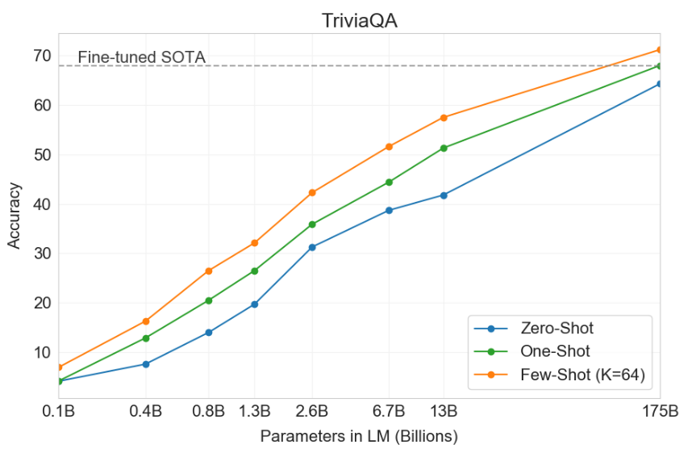
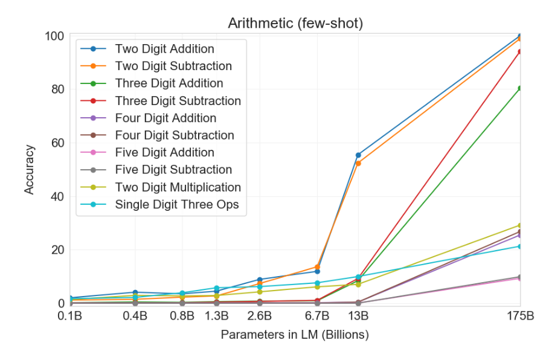

# 第2章 大模型的能力

## 2.1 概述

在本次课程中，我们将深入探讨GPT-3——这个具有代表性的大型语言模型的能力。我们的研究主要基于[GPT-3论文](https://arxiv.org/pdf/2005.14165.pdf)中的基准测试，这些测试包括：

- 标准的自然语言处理（NLP）基准测试，例如问题回答；
- 一些特殊的一次性演示，例如在句子中使用新词。

对比每个任务的最新技术成果，我们发现GPT-3的结果参差不齐：

- 在某些任务上，比如语言建模，GPT-3大幅度超越了现有技术的最高水平；
- 在其他任务上，GPT-3与训练有素，拥有大量标签数据的系统竞争时，却明显落后。

对于这些结果，我们应如何理解呢？

首先，我们需要明白，GPT-3并未明确针对这些任务进行训练，它只是作为一个语言模型，被训练来预测下一个词。然而，即便没有“特别努力”，GPT-3平均来看，仍然可以在广泛的NLP任务中做得不错。

由于GPT-3并未特别针对任何这些任务进行训练，因此它并未过度拟合，意味着它有很大的潜力在许多其他任务上表现良好（就像在一次性任务上的表现一样）。

此外，如果你希望在任何特定任务（例如问题回答）上表现良好，原则上你应能够利用大量的标签数据来适应GPT-3，并超越当前的技术水平。

## 2.2 语言模型的适应性：从语言模型到任务模型的转化

在自然语言处理的世界中，语言模型 $p$ 是一种对token序列 $x_{1:L}$ 的分布。这样的模型能够用于评估序列，例如 $p(𝗍𝗁𝖾,𝗆𝗈𝗎𝗌𝖾,𝖺𝗍𝖾,𝗍𝗁𝖾,𝖼𝗁𝖾𝖾𝗌𝖾)$ 。同样，它还能用于在给定提示的条件下生成完成的序列，如 $\text{𝗍𝗁𝖾 𝗆𝗈𝗎𝗌𝖾 𝖺𝗍𝖾}⇝\text{𝗍𝗁𝖾 𝖼𝗁𝖾𝖾𝗌𝖾}$ 。

在这里，任务被定义为从输入映射到输出。以问答任务为例，我们可能有如下的输入输出：
```
输入：What school did Burne Hogarth establish?
输出：School of Visual Arts
```

我们使用“适应（Adaptation）”一词来指代将语言模型转化为任务模型的过程。这个过程需要以下两个输入：

1. 任务的自然语言描述
2. 一组训练实例（输入-输出对）

我们主要有两种方式来进行这种适应：

- 训练（标准的有监督学习）：训练一个新模型，使其能将输入映射到输出。这可以通过创建一个新模型并利用语言模型作为特征（探针法），或者从现有的语言模型出发，根据训练实例进行更新（微调），或者在这两者之间找到平衡（轻量级的微调）。以上内容会将在第七章进行学习（[大模型之Adaptation](https://github.com/datawhalechina/so-large-lm/blob/main/docs/content/ch07.md)）。
- 提示（上下文）学习：根据对任务的描述建一个或一组提示/上下文信息，将其输入到语言模型中以获取基于该任务的生成结果。根据提示/上下文信息的数量，我们还可以进一步细分：
    - 零样本学习(Zero-shot)：提示/上下文信息的数量为0，模型直接基于对任务的理解输出结果。
    - 单样本学习(One-shot)：提示/上下文信息的数量为1，一般来说模型基于1个例子可以更好的理解任务从而较好的生成结果。
    - 少样本学习(Few-shot)：提示/上下文信息的数量大于1，大模型可以看到更丰富的例子，一般来说获得比单样本学习更好的效果。

在这个选择过程中，训练可能会因为过拟合而变得具有挑战性（例如，想象一下根据5个例子微调一个有1750亿参数的模型）。如何有效进行训练将会在这门课程之后中进行讨论。现在，我们将先满足于使用提示进行GPT-3的适应。但是值得注意的是，提示的局限性在于我们只能利用少量的训练实例（一般情况只能塞进一个提示的数量）。这种输入的局限性由于Transformer自身的局限性导致的，模型可输入的长度具有约束（一般来讲是2048个tokens）。

在GPT-3的论文中，作者们评估了GPT-3在大量任务上的表现。我们将选择其中的一部分，对于每个任务，我们会讨论以下几点：
- 定义：任务是什么，以及其动机？
- 适应：我们如何通过提示将任务简化为语言模型？
- 结果：与该任务的最先进模型相比，GPT-3的定量性能如何？

模型的大小和训练样本的数量都很重要。在下面的多个任务中，对于GPT-3的默认实验设置为：
- 完整的GPT-3模型（davinci），其拥有1750亿参数。
- 使用尽可能多的使用训练数据的实例进行上下文学习。

在此过程中，实验将进行消融实验，以查看模型的大小和上下文训练实例的数量是否真的重要。对于实验结果这里先做一个预告，大模型具体很不错的性能，并且上下文的数量更多总是更好。实验的任务选择如下：
- Language modeling
- Question answering
- Translation
- Arithmetic
- News article generation
- Novel tasks

### 2.1.1 Language Modeling

在自然语言处理（NLP）领域，除了研究大型语言模型，我们还需深入探讨一些基础任务。比如，我们要对GPT-3的各种功能有深入的认知，并真正理解如何优化给模型的提示（当前只通过基于提出信息就可以获得性能的提示已经成为了共识）。这些都是语言模型研究的核心部分。最直观的方法是验证语言模型是否能够有效地模仿和理解语言。

我们回顾之前在引言中提到的语言模型的内容，语言模型 $p$ 是关于词汇序列的概率分布。假设我们有一段文本 $x_{1:L}$ ，例如：

$$
\text{𝗍𝗁𝖾 𝗆𝗈𝗎𝗌𝖾 𝖺𝗍𝖾 𝗍𝗁𝖾 𝖼𝗁𝖾𝖾𝗌𝖾}
$$

我们可以询问：语言模型会给这段文本分配什么概率？

$$
p(\text{𝗍𝗁𝖾 𝗆𝗈𝗎𝗌𝖾 𝖺𝗍𝖾 𝗍𝗁𝖾 𝖼𝗁𝖾𝖾𝗌𝖾})
$$

我们知道，可以将联合概率分解为每个令牌的条件概率的乘积，这是通过链式规则完成的：

$$
p(x_{1:L}) = \prod_{i=1}^L p(x_i \mid x_{1:i-1}).
$$

困惑度（Perplexity）是一个重要的指标，是自然语言处理和语言模型中的一个重要概念，用于衡量语言模型的性能。它可以解释为模型在预测下一个词时的平均不确定性。简单来说，如果一个模型的困惑度较低，那么它在预测下一个词的时候就会更加准确。对于给定的语言模型和一个测试数据集，困惑度被定义为：

$$
P(X) = P(x_1,x_2,...,x_N)^{(-1/N)}
$$

其中， $X=x_{1},x_{2},...,x_{N}$ 是测试集中的词序列， $N$ 是测试集中的总词数。困惑度与语言模型的质量紧密相关。一个优秀的语言模型应能准确预测测试数据中的词序列，因此它的困惑度应较低。相反，如果语言模型经常做出错误的预测，那么它的困惑度将较高。

一个序列的联合概率取决于其长度，并且随着长度的增长，其值趋近于零，这使得困惑度变得难以追踪。直观上，我们希望对每个词标记（token）的概率 $p(x_{i}∣x_{1:i−1})$ 进行平均。这里的 p(xi∣x1:i−1) 表示给定之前的词序列 $x_{1:i−1}$ 后，下一个词 $x_{i}$ 出现的概率。这样做的目的是评估模型在处理各种词标记时的平均性能。

事实上不希望采取算术平均，因为如果给一个词标记分配了0的概率（即我们的模型认为这个词在特定的上下文中绝对不可能出现），那么在算术平均中这会造成极大的问题。因为算术平均并不会为此惩罚你，它只是简单地将所有词标记的概率加在一起，然后除以总数，因此一个非常低的概率（如0）可能会被其他较高的概率抵消。

相反，我们希望采用几何平均，这就是困惑度（perplexity）所做的。在几何平均中，每个词标记的概率都被同等看待，并且一个极低的概率（如0）将会导致整个几何平均大幅度下降。因此，通过计算几何平均，我们可以更好地衡量模型在处理所有可能的词标记时的性能，特别是在处理那些模型可能会出错的情况。

$$
\text{perplexity}_p\left(x_{1: L}\right)=\exp \left(\frac{1}{L} \sum_{i=1}^L \log \frac{1}{p\left(x_i \mid x_{1: i-1}\right)}\right) \text {. }
$$

<!--
\operatorname 这个宏不能用
The following macros are not allowed: \operatorname
-->

困惑度可以被理解为每个标记（token）的平均"分支因子（branching factor）"。这里的“分支因子”可以理解为在每个位置，模型认为有多少种可能的词会出现。例如，若困惑度为10，那意味着每次模型在预测下一个词时，平均上会考虑10个词作为可能的选择。

这个理解与公式中的 $\log \frac{1}{p\left(x_i \mid x_{1: i-1}\right)}$ 密切相关，这个表达式代表了编码长度。我们在计算的是平均编码长度，这个长度反映了给定当前词或标记后，下一个词或标记可能的选择数量。因此，通过对平均编码长度取指数，我们可以得到可能的选择数量，这也就是"分支因子"。

为了更好地理解，我们可以考虑一个均匀分布的例子：一个长度为3的二进制字符串可以编码 $2^3=8$个可能的字符串。同样，困惑度反映了模型预测下一个词时，考虑的平均可能性数。如果困惑度为8，那么对于序列中的每个词，模型会考虑8个可能的词。这个例子类似于我们的语言模型：在给定特定词或标记后，模型需要从多个可能的选项中预测下一个词或标记。如果选择的可能性多，模型的预测任务就更为复杂，相应的困惑度就会更高。

**两类错误**：语言模型可能会犯两种类型的错误，而困惑度对这两种错误的处理方式并不对称：

- 召回错误：语言模型未能正确地为某个词符分配概率值。这种情况下，困惑度是毫不留情的。例如，如果模型为词组 '𝖺𝗍𝖾' 在 '𝗍𝗁𝖾,𝗆𝗈𝗎𝗌𝖾' 后出现的概率预测为接近0，那么对应的困惑度值将趋近于无穷大。

$$
p({ate} \mid {the}, {mouse}) \to 0 \quad\Rightarrow\quad \text{perplexity}_p({the}, {mouse}, {ate}, {the}, {cheese}) \to \infty.
$$

- 精确度错误：语言模型为某些错误的词序列过度分配了概率值。在这种情况下，困惑度会进行适度的惩罚。给定一个语言模型 p，假设我们将一些垃圾分布 $r$ 按照概率 $ϵ$ 混入：

$$
q(x_i \mid x_{1:i-1}) = (1-\epsilon) p(x_i \mid x_{1:i-1}) + \epsilon r(x_i \mid x_{1:i-1}).
$$

那么，我们可以计算在 $q$ 下的 $x_{1:L}$ 的困惑度：

$$
\text{perplexity}_q(x_{1:L}) \le \frac{1}{1 - \epsilon} \text{perplexity}_p(x_{1:L}) \approxeq (1 + \epsilon) \text{perplexity}_p(x_{1:L}),
$$

其中，最后一个近似等式在 $ϵ$ 的值较小时成立。如果我们混入5%的垃圾信息，那么困惑度只增加 5%。需要注意的是，这样生成的语言结果会非常糟糕，因为平均每 20 个词符就会生成一个无意义的词符。

现在，我们继续评估实际数据集上的困惑度。"

#### 2.1.1.1 Penn Tree Bank
[Penn Tree Bank](https://catalog.ldc.upenn.edu/LDC99T42) 是自然语言处理中的一个经典数据集，最初是为了进行句法解析而标注的。从[Emami和Jelinek（2004）](https://ieeexplore.ieee.org/stamp/stamp.jsp?tp=&arnumber=1325968)和[Mikolov和Zweig（2012）](https://ieeexplore.ieee.org/stamp/stamp.jsp?tp=&arnumber=6424228)开始，一个只包含华尔街日报文章的版本被用作语言模型评估。需要注意的是，若对PTB数据集使用语言模型对其基准进行测试，需要原始数据集做一些重要预处理，比如数据格式转换（感谢[John Hewitt](https://nlp.stanford.edu/~johnhew/)的指出）。

适应性测试。将整个文本作为提示输入到GPT-3中，并评估其困惑度（示例）："

```
Pierre Vinken, 61 years old, will join the board as a nonexecutive director Nov. 29. Mr. Vinken is chairman of Elsevier N.V., the Dutch publishing group.
```

**结果：** GPT-3大幅度的超过了目前的最好结果（state-of-the-art）

|Model|Perplexity|
|---|---|
|GPT-3|**20.5**|
|BERT-Large-CAs1|31.3|

那这个结果是否存在训练/测试泄露问题呢？作者没有在一些数据集上进行评估，例如WikiText-103。我们知道GPT-3是在维基百科上进行训练的，因此在这方面PTB是具有优势的，因为它早于互联网，并且只能通过付费许可获得，或许泄露问题会有所缓解。但是我们也要知道，数据泄露是当前大型数据集的另一个复杂问题：很难检查你的测试数据是否出现在你的训练数据中，并被记忆下来。

#### 2.1.1.2 [LAMBADA](https://arxiv.org/pdf/1606.06031.pdf)
该数据的任务：预测句子的最后一个词。
动机：解决这个任务需要对较长的内容进行建模，并对较长的内容具有一定的依赖。

LAMBADA本身是一个语言模型，因此就是使用自回归的方式生成下一个词，由于该任务的目的在于要求模型完成句子中的最后一个词。因此，一个关键的挑战是，模型默认情况下并不会识别出它需要生成的恰恰是句子的最后一个词。为了克服这一问题，我们需要将任务设计为更加明确的输入-输出映射关系。具体来说，通过提供额外的示例进行上下文学习，我们可以让模型学会在给定输入的情况下产生相应的输出，从而有效地解决了模型在完成句子时定位最后一个词的难题。
```
Fill in blank:  
  
Alice was friends with Bob. Alice went to visit her friend ___. -> Bob  
  
She held the torch in front of her.  
She caught her breath.  
“Chris? There’s a step.”  
“What?”  
“A step. Cut in the rock. About fifty feet ahead.” She moved faster. They both moved faster. “In fact,” she said, raising the torch higher, “there’s more than a ___. -> step
```
结果：GPT-3超过了之前的最好结果（GPT-2）

|Model|Perplexity|
|---|---|
|GPT-3 (few-shot)|**1.92**|
|SOTA|8.63|

#### 2.1.1.3 [HellaSwag](https://arxiv.org/pdf/1905.07830.pdf)
动机：评估模型进行常识推理的能力
任务：从一系列选择中选出最适合完成句子的选项

该数据是一个多项选择任务，所以最自然的做法是用语言模型为每个候选答案打分，并预测“最佳”答案（示例）：
```
Making a cake: Several cake pops are shown on a display. A woman and girl are shown making the cake pops in a kitchen. They ${answer}
```

其中 ${answer}$ 是以下选项之一：
1. _bake them, then frost and decorate._
2. _taste them as they place them on plates._
3. _put the frosting on the cake as they pan it._
4. _come out and begin decorating the cake as well._

给定一个问题 x，你如何对候选答案 y 进行评分呢？没有明确的答案，但这里有一些启发式方法：
- 未归一化的概率(Unnormalized probability)： $score(x,y)=p(x,y)$ 。未归一化概率的问题是它倾向于短答案。
- 长度归一化概率(Length-normalized probability)： $score(x,y)=p(x,y)/num-tokens(y)$ 。这修正了长度偏见。然而，对于长度相同的两个答案，模型仍可能偏好更受欢迎的实体。
- 频率归一化概率(Frequency-normalized probability)： $score(x,y)=p(y∣x)/p(y∣x_{0})$ ，其中 $x_{0}$ 是一个中立的字符串，如'Answer:'。这降低了恰巧很常见的答案（例如，“John”）的得分。

**结果：**GPT-3接近但没有超过最先进的水平：

|Model|Accuracy|
|---|---|
|SOTA|**85.6**|
|GPT-3|79.3|

我需要知道的是，SOTA结果是在该数据集的训练集中微调得到的结果，因此GPT-3在完全不在该数据集训练的情况下获得了接近的结果是很令人惊喜的。

### 2.1.2 Question answering
我们现在考虑（闭卷）问答题，其中输入是一个问题，输出是一个答案。语言模型必须以某种方式“知道”答案，而无需在数据库或一组文档中查找信息。
```
Input: What school did burne hogarth establish?  
Output: School of Visual Art
```

#### 2.1.2.1 [TriviaQA](https://arxiv.org/pdf/1705.03551.pdf)
任务：给定一问题后生成答案
原始数据集是由业余爱好者收集的，并被用作开放式阅读理解的挑战，但我们用它来进行（闭卷）问题回答。我们根据训练实例和问题定义一个提示，并将完成的内容作为预测的答案：
```
Q: ‘Nude Descending A Staircase’ is perhaps the most famous painting by which  
20th century artist?  
A: Marcel Duchamp
```

**结果：**

|Model|Accuracy|
|---|---|
|RAG|68.0|
|GPT-3 (zero-shot)|64.3|
|GPT-3 (few-shot)|**71.2**|

我们也看到，增加模型大小和增加in-context training实例都有助于提高性能：



#### 2.1.2.2 [WebQuestions](https://aclanthology.org/D13-1160.pdf)
任务：和TriviaQA类似是问答任务
数据集从Google搜索查询中收集，最初用于对知识库的问题回答。我们定义一个提示，就如TriviaQA一样（演示）：

```
Q: What school did burne hogarth establish?  
A: School of Visual Arts
```

**结果：**

|Model|Accuracy|
|---|---|
|RAG|**45.5**|
|GPT-3 (zero-shot)|14.4|
|GPT-3 (few-shot)|41.5|

#### 2.1.2.3 NaturalQuestions

任务：回答问题
从Google搜索查询中收集的数据集（区别在于答案的长度较长）我们和上面一样定义一个提示：
```
Q: Who played tess on touched by an angel?  
A: Delloreese Patricia Early (July 6, 1931 - November 19, 2017), known professionally as Della Reese.
```

**结果：**

|Model|Accuracy|
|---|---|
|RAG|**44.5**|
|GPT-3 (zero-shot)|14.6|
|GPT-3 (few-shot)|29.9|

### 2.1.3 Translation
翻译任务是将源语言（例如，德语）中的句子翻译成目标语言（例如，英语）中的句子。自1960年代以来，机器翻译一直是NLP的长期任务，2000年代开始，在NLP（拥有自己独特的子社区）中，统计机器翻译开始飞速发展，紧随其后的是2010年代中期的神经机器翻译。由于存在人类翻译者，因此它一直是一个数据丰富的领域。标准的评估数据集比如是WMT’14和WMT’16数据集。由于存在多种可能的翻译，所以（自动）评估指标是BLEU（它捕获了n-gram重叠的概念）。对于Few-shot的情况，我们构造了一个包含输入-输出训练实例以及输入的提示（演示）：

```
Mein Haus liegt auf dem Hügel. = My house is on the hill.  
Keinesfalls dürfen diese für den kommerziellen Gebrauch verwendet werden. = In no case may they be used for commercial purposes.
```

**结果：**这里是从德语到英语的结果：

|Model|Accuracy|
|---|---|
|SOTA (supervised)|40.2|
|GPT-3 (zero-shot)|27.2|
|GPT-3 (few-shot)|40.6|
- 即使没有监督训练数据，GPT-3也能达到全监督系统的最新技术水平！
- 这为机器翻译的性能设定了一个下限；因为肯定会想利用大量的平行语料库（对齐的输入-输出对）。
- 法语和罗马尼亚语的结果类似。
- 从英语到外语的结果要差得多，这是可以预料的，因为GPT-3主要是一个英语模型。

### 2.1.4 Arithmetic
GPT-3是一个语言模型（主要是英语），但我们可以在一系列更“抽象推理”的任务上评估它，以评估GPT-3作为更通用模型的性能。

这里的Arithmetic任务是做算术题（2-5位数的加法，减法，乘法）你没有实际的理由要解决这个问题；这只是一个诊断任务，满足我们的科学好奇心。我们将问题提出为问题回答：
```
Q: What is 556 plus 497?  
A: 1053
```

**结果：**

 

从实验结果看起来，虽说不能认为GPT-3获得很好的结果，但是还是让我们惊艳，并对未来充满想象。

### 2.1.5 News article generation
任务：给定标题和副标题，生成新闻文章。
数据集：标题/副标题取自[newser.com](https://stanford-cs324.github.io/winter2022/lectures/capabilities/newser.com)。
我们设立了一个评估标准，人类根据文章可能由机器编写的可能性对文章进行评分。我们在上下文学习中给模型提供提示样本：
```
Title: United Methodists Agree to Historic Split  
Subtitle: Those who oppose gay marriage will form their own denomination  
Article: After two days of intense debate, the United Methodist Church has agreed to a historic split - one that is expected to end in the creation of a new denomination, one that will be "theologically and socially conservative," according to The Washington Post. The majority of delegates attending the church's annual General Conference in May voted to strengthen a ban on the ordination of LGBTQ clergy and to write new rules that will "discipline" clergy who officiate at same-sex weddings. But those who opposed these measures have a new plan: They say they will form a separate denomination by 2020, calling their church the Christian Methodist denomination...
```

**结果：**人类只有52%的概率能够正确地分类“人类”与“机器”（几乎只是随机机会）。

### 2.1.6 Novel tasks
#### 2.1.6.1 使用新词
任务：给定一个新造的词和定义，生成使用该词的句子。
我们依旧只需在提示中描述任务：
```
To “screeg” something is to swing a sword at it. An example of a sentence that uses the word screeg is: We screeged the tree with our swords.
```

#### 2.1.6.2 纠正英语语法
任务：给定一个不合语法的句子，生成其合语法的版本。
我们通过给出提示来描述任务（提示是有输入和输入对组成的）：
```
Poor English input: I eated the purple berries.  
Good English output: I ate the purple berries.  
Poor English input: Thank you for picking me as your designer. I’d appreciate it.  
Good English output: Thank you for choosing me as your designer. I appreciate it.  
Poor English input: The mentioned changes have done. or I did the alteration that you  
requested. or I changed things you wanted and did the modifications.  
Good English output: The requested changes have been made. or I made the alteration that you  
requested. or I changed things you wanted and made the modifications.  
Poor English input: I’d be more than happy to work with you in another project.  
Good English output: I would be happy to work with you on another project.
```

### 2.1.7 Other tasks
自原始论文以来，GPT-3已应用于许多更多的任务，包括基准数据集(Benchmark)和一次性的演示(one-off deoms)。以下是一个不详尽的列表:
**Benchmarks：**
- [SWORDS](https://arxiv.org/pdf/2106.04102.pdf)：词汇替换，目标是在句子的上下文中预测同义词。
- [Massive Multitask Language Understanding](https://arxiv.org/pdf/2009.03300.pdf)：包括数学，美国历史，计算机科学，法律等57个多选问题。
- [TruthfulQA](https://arxiv.org/pdf/2109.07958.pdf)：人类由于误解而错误回答的问答数据集。
**结果：**虽说GPT-3在这些Benchmark数据集中的表现平庸，但是考虑到我们只使用了few-shot的情况，或许不算太差。

**one-off Demos：**
- [Examples from the OpenAI website](https://beta.openai.com/examples/)
- [Examples from gpt3demo.com](https://gpt3demo.com/)
这些演示既创新又有趣，但很难判断它们的可靠性如何。

### 2.1.8 总结
- GPT-3在广泛的标准NLP基准测试和一次性任务上进行了评估。
- GPT-3可以表现得极好或者非常普通。
- 增加模型的大小和示例的数量都有助于提高性能。
- 有一些启发式的方法可以将语言模型适应到感兴趣的任务。
- 但是为什么会有这样表现，没有人知道。

## 延伸阅读

- [Language Models are Few-Shot Learners](https://arxiv.org/pdf/2005.14165.pdf). _Tom B. Brown, Benjamin Mann, Nick Ryder, Melanie Subbiah, J. Kaplan, Prafulla Dhariwal, Arvind Neelakantan, Pranav Shyam, Girish Sastry, Amanda Askell, Sandhini Agarwal, Ariel Herbert-Voss, Gretchen Krueger, T. Henighan, R. Child, A. Ramesh, Daniel M. Ziegler, Jeff Wu, Clemens Winter, Christopher Hesse, Mark Chen, Eric Sigler, Mateusz Litwin, Scott Gray, Benjamin Chess, Jack Clark, Christopher Berner, Sam McCandlish, Alec Radford, Ilya Sutskever, Dario Amodei_. NeurIPS 2020.
- [Blog post explaining perplexity](https://towardsdatascience.com/perplexity-in-language-models-87a196019a94)
