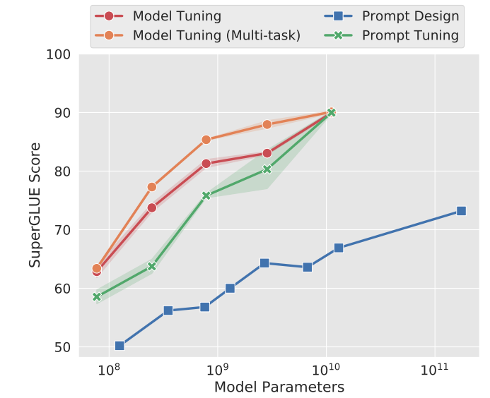
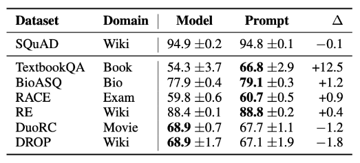
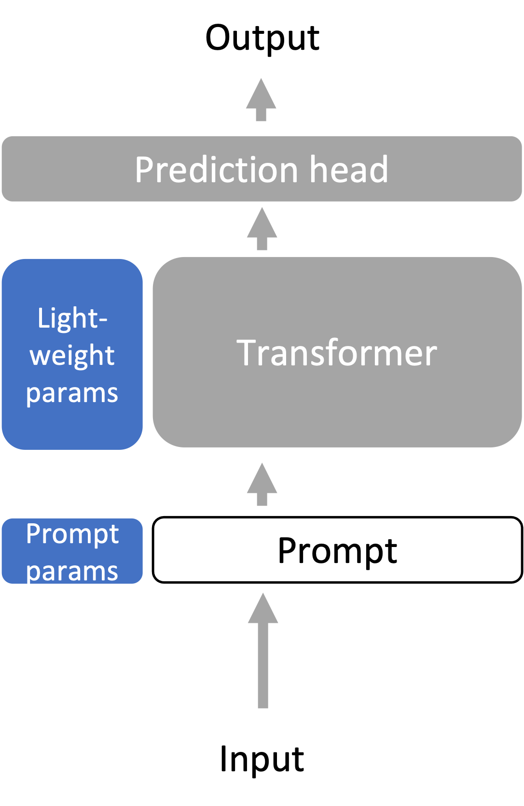

# 第7章 大模型之Adaptation


使用语言模型（例如在上下文学习中）通过仅给出提示，我们已经能够执行一些任务。然而，提示方法并不适用于全部的下游任务，如自然语言推理（NLI）、问题回答（QA）、将网络表格转换为文本、解析电子健康记录（EHR）等。

下游任务与语言模型的训练数据（例如，Pile数据集）可能在格式和主题上有所不同，或者需要随时间更新新知识。因此，语言模型需要使用特定于任务的数据或领域知识来针对下游任务进行适配。

## 7.1 引言

### 7.1.1 为什么需要Adaptation?
在自动化和人工智能的时代，语言模型已成为一个迅速发展的领域。这些模型被训练为对各种各样的任务作出响应，但它们真的适合所有的任务吗？在探讨这一问题之前，我们需要理解语言模型如何被训练，并明确下游任务与原始训练任务之间可能存在的不同之处。

从语言模型的训练方式来说，语言模型，例如GPT-3，通常是任务不可知（task-agnostic）[^task-agnostic这个词组用于描述一种不针对任何特定任务进行优化的方法或模型。在机器学习和人工智能的背景下，task-agnostic通常指的是一种可以在多个不同任务上运行，而不需要对每个单独任务进行特别调整或训练的方法。例如，一个task-agnostic的语言模型在训练时不会专门针对特定任务进行优化，例如情感分析、文本摘要或问题回答。相反，它被设计为能够捕捉到语言的通用特性和结构，以便可以用于许多不同的下游任务。这种方法的优点是灵活性和广泛适用性，因为相同的模型可以用于各种各样的应用。然而，它也可能带来挑战，因为通用模型可能在特定任务上不如专门为该任务训练的模型表现出色。这就引出了如何将task-agnostic的模型适应特定任务的需求，以便在不同的应用场景中实现最佳性能。]的，这意味着它们在一个广泛的领域内进行训练，而不是针对特定任务。这种方法的优点在于模型具有广泛的适用性，但也带来了一些挑战。比如下游任务的多样性，不同的下游任务与语言模型的预训练方式可以非常不同，这可能导致问题。例如，自然语言推理（NLI）任务与Pile数据集上的语言建模任务可能完全不同。考虑以下例子：
```
- **Premise**: I have never seen an apple that is not red.
- **Hypothesis**: I have never seen an apple.
- **Correct output**: Not entailment (the reverse direction would be entailment)
```
这种格式对模型来说可能并不自然，因为它远离了模型的训练范围。

另外在处理下游任务时，与原始训练任务之间的差异可能造成一些挑战。这些不同之处可以从以下几个方面进行详细探讨：

1. **格式的不同**:
- **自然语言推理（NLI）**: 下游任务如NLI涉及两个句子的比较以产生单一的二进制输出。这与语言模型通常用于生成下一个标记或填充MASK标记的任务截然不同。例如，NLI的逻辑推理过程涉及多层次的比较和理解，而不仅仅是根据给定的上下文生成下一个可能的词。
- **BERT训练与MASK标记**: BERT训练过程中使用了MASK标记，而许多下游任务可能并不使用这些标记。这种不同可能导致在针对具体任务时需要对模型进行显著的调整。

2. **主题转变**:
- **特定领域的需求**: 下游任务可能集中在特定的主题或领域上，例如医疗记录分析或法律文档解析。这些任务可能涉及专门的术语和知识，与模型的通用训练任务相去甚远。
- **广泛主题的灵活性**: 语言模型可能需要处理各种不同的主题。如果下游任务突然聚焦在一个新的或非常独特的领域上，这可能会超出模型的训练范围。

1. **时间转变**:
- **新知识的需求**: 随着时间的推移，新的信息和知识不断涌现。例如，GPT-3在拜登成为总统之前就已训练完毕，因此可能缺乏有关他总统任期的最新信息。
- **非公开信息的需求**: 有时下游任务可能涉及在训练期间不公开的信息。这可能需要更多特定领域的专业知识和调整。

因此可以总结一下”为什么需要语言模型的Adaptation?“，下游任务与语言模型的训练任务之间的不同之处非常复杂。这些差异可以从格式、主题和时间三个方面来探讨，每个方面都可能涉及许多具体的挑战和需求。通过深入了解这些不同之处，我们可以更好地理解如何有效地适配语言模型以满足各种下游任务的需求。

### 7.1.2 通用的adaptation配置
下面提供使用预训练语言模型（LM）的参数来适配（adapt）下游任务的一般设置。下面我将这个过程分为相关且逐渐递进的各个部分：

1. **预训练语言模型（Pre-trained LM）**:
在适配阶段的开始，我们已经有了一个预训练的语言模型，用参数$θLM$表示。这个模型被训练来理解和生成语言，但不是特别针对任何特定任务。

2. **下游任务数据集（Downstream Task Dataset）**:
我们获得了一组来自下游任务分布$P_{task}$的样本数据。这些数据可以是文本分类、情感分析等任务的特定实例，每个样本由输入x和目标输出y组成，如：$\left(x^{(1)}, y^{(1)}\right), \ldots,\left(x^{(n)}, y^{(n)}\right)$。

3. **适配参数（Adaptation Parameters）**:
为了使预训练的LM适合特定的下游任务，我们需要找到一组参数$\gamma$，这组参数可以来自现有参数的子集或引入的新的参数，$\Gamma$。这些参数将用于调整模型，以便它在特定任务上的表现更好。

4. **任务损失函数（Task Loss Function）**:
我们需要定义一个损失函数$\ell_{\text {task }}$来衡量模型在下游任务上的表现。例如，交叉熵损失是一种常见的选择，用于衡量模型预测的概率分布与真实分布之间的差异。

5. **优化问题（Optimization Problem）**:
我们的目标是找到一组适配参数$\gamma_{\text {adapt }}$，使得任务损失在整个下游数据集上最小化。数学上，这可以通过以下优化问题表示：
$$
\gamma_{\text {adapt }}=\operatorname{argmin}_{\gamma \in \Gamma} \frac{1}{n} \sum_{i=1}^n \ell_{\text {task }}\left(\gamma, \theta_{\mathrm{LM}}, x_i, y_i\right) .
$$

通过这个过程，我们可以取得一组适配参数$\gamma_{\text {adapt }}$，用于参数化适配后的模型$p_{adapt}$。这样，我们就可以将通用的、任务无关的预训练语言模型适配到特定的下游任务上，以实现更好的性能。这种适配方法将模型的通用性与特定任务的效能结合在一起，既保留了模型的灵活性，又确保了在特定任务上的高效表现。

## 7.2 当前主流的几种Adaptation方法

### 7.2.1 Probing

Probing（探针）策略是大规模预训练阶段就已经广泛使用的一种微调策略，这一小节将讨论探测（Probing）策略的引入及其应用，同时探讨固定长度表示的策略。

#### 7.2.1.1 Probing方法的引入

Probing是一种[分析和理解模型内部表示](https://arxiv.org/pdf/1909.03368.pdf)的技术。它引入了一个新的参数集$\Gamma$，用于定义Probing，这些Probing通常是线性的或浅前馈网络。通过Probing方法，我们可以检查和理解模型的表示。例如，如果一个简单的探针可以预测词性标注（POS），那么这些表示就“存储”了POS信息。

#### 7.2.1.2 Probing的适用性和适配

探测主要适用于仅编码器模型（例如，[BERT](https://arxiv.org/pdf/1810.04805.pdf)），但解码器模型也可以使用（[Liu et al. 2021](https://arxiv.org/pdf/2103.10385.pdf)）。对于Adaptation来说，我们从语言模型（LM）的最后一层表示中训练一个Probing（或预测头）到输出（例如，类标签），整体的形式如下图所示：
![[./images/probing.png.png]]

#### 7.2.1.3 固定长度表示的策略

我们可以发现Probing方法是通过线性的或浅前馈网络来学习预训练模型的输出，并获得分析和理解模型内容表示的能力，从而在下游任务中取得不错的表现。值得一提的是，Probing方法对于预训练模型本身的权重是固定的，只对参数量很少的线性的或浅前馈网络进行训练，因此符合Adaptation，大大的减缓训练成本。

但是这样又引出了一个问题，对于预训练模型的输入，线性的或浅前馈网络需要对多少内容进行表征才可以呢？因此自然的引出了固定长度表示的策略。由于许多任务（例如分类）需要固定长度的输出，Transformer编码器如何将$L$个令牌映射到1个嵌入向量成为了一个问题。下面介绍了两种常见策略：

1. **CLS token策略（[Devlin et al. 2018](https://arxiv.org/pdf/1810.04805.pdf)）**：在预训练和微调期间，我们在提示符前加上一个名为CLS的特殊token。我们使用与CLS token对应的嵌入向量作为“序列级”嵌入。
2. **平均化token策略**：另一种常见方法是对$L$个token求平均。注意，由于每个嵌入向量都是上下文相关的并且位置依赖的，这并不使模型具有置换不变性。

#### 7.2.1.4 总结

探测作为一种强大的分析工具，通过冻结语言模型表示编码器（上图中灰色部分）和优化特定任务的探针（上图中预测头，蓝色部分）来工作。这些模型可以是线性的或浅前馈预测头，提供了一种灵活的方法来理解和解释深度学习模型的内部工作机制。固定长度表示的策略也进一步促进了这一目的，提供了灵活而有效的解决方案。


###  7.2.2 Fine-tuning

Fine-tuning（微调）使用语言模型参数$θLM$作为优化的初始化。其中，优化后的参数家族$\Gamma$包括了所有的语言模型参数和任务特定的预测头参数。与此同时，预训练的优化器状态被丢弃。

在微调过程中，通常至少使用比预训练时小一个数量级的学习速率，而且微调的时长远远少于预训练。这意味着需要存储针对每个下游任务专门化的大型语言模型，这可能相当昂贵。然而，微调是在更大的模型家族（即，非常具有表现力）上进行优化的，并且通常比探针有更好的性能。

#### 7.2.2.1 Fine-tuning对于zero-shot能力

zero-shot learning（零样本学习）是一种机器学习范式，在训练阶段没有见过的任务或类别上进行泛化的能力。它允许模型在没有任何具体示例的情况下解释和处理全新的信息。这个能力对于许多实际应用至关重要，特别是当新任务或类别的样本难以获得时。

零样本学习的能力使得模型具有更高的灵活性和泛化能力，能够在未见过的任务上迅速适应。这在现实世界中极为重要，因为我们常常会遇到一些新的、未在训练数据中出现过的任务或情境。零样本学习模型可以迅速解决这些问题，而无需每次都进行繁琐的重新训练。

针对零样本性能的微调是对现有模型的进一步优化，可以提高模型在未见过的任务上的表现。以下是经过微调后对零样本性能的影响：

- **模型调整**：技术如[FLAN](https://arxiv.org/pdf/2109.01652.pdf)和[T0](https://arxiv.org/pdf/2110.08207.pdf)微调模型以获得更好的零样本性能。它们通过统一许多下游任务的prompt format（提示格式），并根据此格式微调模型来执行各种各样的任务。
- **性能提升**：与原始语言模型相比，未见任务的零样本性能得到了显著提高。这表明微调可以有效地改善模型的泛化能力。
- **学习新技能**：模型正在学习使用提示格式来执行零样本任务。这样的提示格式有助于引导模型理解和完成全新的任务，从而实现了真正的零样本学习。

#### 7.2.2.2 用于人类对齐语言模型的Fine-tuning

在当前的LLMs中，指令（instructions）常常作为输入提示（prompt），来引导模型产生特定类型的输出。有效的指令可以让模型更好地理解人类用户的需求，并产生有用、诚实、无害的反馈，LLMs带来的有害性参考之前学习内容。人类反馈是指从人类用户或评估者收集的反馈，以评价模型的输出是否符合人们的期望和需求。人类反馈在模型的训练和微调中起着关键作用。

#### 7.2.2.3 微调的过程和影响

微调可以使语言模型更好地与人类价值观和目标一致。下面是InstructGPT对GPT-3模型进行微调的三个步骤：

1. **收集人类书写的示范行为**：这一步骤涉及收集符合人类期望的示例，并对这些示例进行监督微调。
   
2. **基于指令的采样与人类偏好**：对于每个指令，从步骤1的LM中采样k个输出。然后收集人类对哪个采样输出最优先的反馈。与步骤1相比，这些数据更便宜。

3. **使用强化学习目标微调LM**：通过强化学习目标微调步骤1中的LM，以最大化人类偏好奖励。

经过这样的微调，1.3B的InstructGPT模型在85%的时间里被优先于175B的GPT-3，使用少样本提示时为71%。在封闭领域的问答/摘要方面，InstructGPT 21%的时间会产生虚构信息，相比GPT-3的41%有所改善。在被提示要尊重时，InstructGPT比GPT-3减少了25%的有毒输出。


#### 7.2.2.4 总结

- 冻结（灰色）：无需任何操作。
- 优化（蓝色，每个任务有所不同）：语言模型的所有参数，外加一个新的预测头。

微调是一种强大的工具，可以使预先训练的语言模型更好地符合人类的期望和需求。通过监督学习、人类反馈和强化学习等手段，可以显著提高模型在特定任务和场景下的性能。然而，仍需关注并解决某些方面的挑战，如偏见和虚构信息的产生，以确保语言模型的安全和可靠使用。虽然有一些挑战和限制，但微调仍然是现代机器学习中一种非常有力的工具。

### 7.2.3 Lightweight Fine-tuning
轻量级微调（Lightweight Fine-Tuning）是一种特殊的微调技术，旨在结合全面微调的表现力和更节省资源的优点。轻量级微调试图在不需要为每个任务存储完整语言模型的同时，保持与全面微调相同的表现力。换句话说，它希望在减小模型存储需求和计算负担的同时，仍然实现出色的性能。

#### 7.2.3.1 轻量级微调的变体

轻量级微调有许多变体，其中一些主要的方法包括：

1. **提示调整（[Prompt Tuning](https://arxiv.org/pdf/2104.08691.pdf)）**：通过微调模型的输入prompt提示来优化模型的表现。提示调整可以被视为一种更灵活的微调方法，允许用户通过调整输入提示来导向模型的输出，而不是直接修改模型参数。
2. **前缀调整（[Prefix Tuning](https://arxiv.org/pdf/2101.00190.pdf)）**：与提示调整类似，前缀调整也集中在输入部分。它通过添加特定前缀来调整模型的行为，从而对特定任务进行定制。
3. **适配器调整（[Adapter Tuning](https://arxiv.org/pdf/1902.00751.pdf)）**：适配器调整是通过在模型的隐藏层之间插入可训练的“适配器”模块来微调模型的一种方法。这些适配器模块允许模型在不改变原始预训练参数的情况下进行微调，从而降低了存储和计算的需求。

#### 7.2.3.2 Prompt Tuning
提示调整（Prompt Tuning）是一种特殊的微调技术，主要用于文本分类任务。Prompt Tuning的灵感来源于推理为基础的自适应提示设计/工程。与传统的微调方法不同，提示调整专注于优化输入提示，而不是改变模型的内部参数。

Prompt Tuning通过在输入前添加$k$个可学习的、连续的标记嵌入（定义为$Γ$）来工作。因此，新的输入长度现在为$L^{′} = L + k$，其中$L$是原始输入的长度。这些额外的标记嵌入通过在带标签的任务数据上进行训练来学习。

与此同时，整个预训练的语言模型被冻结，这意味着模型的主体部分不会在微调过程中发生改变。随着冻结语言模型的规模增加，提示调整的性能变得越来越有竞争力，甚至可以与全面微调（也称为“模型调整”）相媲美。这表明，即使在不改变预训练参数的情况下，也可以通过调整输入提示来获得出色的性能。

提示调整涉及不同的初始化策略，如：

- **随机词汇词嵌入**（Embedding of random vocab words）：选择随机的词汇作为嵌入。
- **类标签词嵌入**（Embedding of class label words）：使用与分类标签相关的词汇进行嵌入。
- **随机初始化**（Random init）：这种方法通常效果不佳，不推荐使用。

需要提一下，[P-Tuning v2](https://arxiv.org/pdf/2110.07602.pdf)这篇工作是提示调整的全层版本。所有层级的参数对文本分类和生成任务都有助益。

总的来说，Prompt Tuning是一种创新的轻量级微调方法，通过在输入上添加可学习的嵌入，而不是改变整个模型的结构来实现任务特定的优化。这不仅减少了计算和存储的需求，而且还允许使用较大的冻结模型来实现与全面微调相当的性能。在文本分类等任务中，提示调整提供了一种灵活和高效的解决方案。



#### 7.2.3.3 Prefix Tuning
前缀调整（Prefix Tuning）是一种特别设计用于语言生成任务的微调方法，已在BART和GPT-2模型上进行了开发。以下是对Prefix Tuning的详细解释：

Prefix Tuning通过在输入的开始处添加k个位置，并在每个注意力层连接额外的可学习权重，作为键（keys）和值（values）来实现。这些附加的权重允许模型在微调过程中学习特定任务的上下文和结构。虽然Prefix Tuning与Prompt Tuning在某些方面有相似之处（例如，都涉及微调输入），但两者之间存在重要区别。比如与Pompt Tuning不同，Prefix Tuning不仅添加可学习的输入，还在每个注意力层中添加可学习的权重。这些权重可以更好地捕获任务特定的依赖关系和上下文信息。

前缀调整使用了一个广义的注意力操作定义，该操作接收3个参数：键（$K$）、值（$V$）和查询（$Q$），分别具有维度$ℝ^{d×L^′}$、$ℝ^{d×L^′}$和$ℝ^{d×L}$。定义如下：

$$\text{Attn-op}(Q,K,V)=V\text{softmax}\left(\frac{K^TQ}{\sqrt{d}}\right)
$$
对于自注意力（self-attention），我们设置$L^{'}$ = $L$，并定义$K$ = $W_{\text{key}}x_{1:L}$，$ V$ = $W_{\text{value}}x_{1:L}$，$Q$ = $W_{\text{query}}x_{1:L}$，其中$W_{\text{key}}$, $W_{\text{value}}$, $W_{\text{query}}$是学习到的权重矩阵。

对于注意力头$i$，Prefix Tuning通过将可学习的权重$P(i)_{\text{key}}$, $P(i)_{\text{value}} \in \mathbb{R}^{d \times k}$与键和值连接，计算具有较大的$L' = L + k$的注意力。这一计算由[He等人在2022年提出](https://arxiv.org/pdf/2110.04366.pdf)：
$$
K_{\text{prefix}} = [P(i)_{\text{key}}, K]
$$

$$
V_{\text{prefix}} = [P(i)_{\text{value}}, V]
$$
$$\text{head}_i = \text{Attn-op}(Q,K_{\text{prefix}},V_{\text{prefix}})
$$
其中$Q = W_{\text{query}}x_{1:L}$，与常规自注意力一样。

所有层级的可训练参数可以增强模型的性能，允许模型在更细粒度上进行优化。

总的来说，前缀调整通过在注意力机制的键和值部分添加可学习的权重，为模型提供了一种强大的微调手段。这种方法允许模型更好地捕捉任务特定的模式，并与提示调整等其他技术相辅相成，提供了一种灵活和强大的任务特定优化手段。

#### 7.2.3.3 Adapter Tuning

Adapter Tuning（适配器调整）是一种微调技术，通过在每个（冻结的）Transformer层之间添加新的学习“bottleneck”层（称为适配器）来实现。

Adapter Tuning 通常是操作于序列中每个元素$x \in \mathbb{R}^d$的2层残差网络。适配器的计算定义如下：
$$
\text{Adapter}(x) = x + W_{\text{up}}\sigma(W_{\text{down}}x)
$$
其中，$W_{\text{down}} \in \mathbb{R}^{r \times d}$和$W_{\text{up}} \in \mathbb{R}^{d \times r}$是学习到的权重，它们将$x$投影到一个瓶颈维度$r$，然后再投影回维度$d$。符号$\sigma$表示一个非线性激活函数。结果$\text{Adapter}(x)$是一个在$\mathbb{R}^d$中与$x$具有相同维度的向量。

总之，适配器调整提供了一种灵活的微调方法，允许在不改变原始Transformer层的情况下，通过引入新的可学习层来调整模型。这种方法与提示调整和前缀调整等技术相结合，为自然语言处理任务提供了一种高效、可扩展的解决方案。适配器的设计使其可以在不牺牲整体模型结构的情况下，增强特定任务的性能。

#### 7.2.3.4 Lightweight Fine-tuning的其他性质

- Lightweight Fine-tuning的表达能力相当复杂，因为它与特定的预训练语言模型（LM）紧密相连。如果预训练LM的权重为0，则Pormpt/Prefix Tuning将不起作用。
- 以上提到的Promt/Prefix/Adapter Tuning提供了一种实现个性化模型的方法。假设我们想为N个用户部署个性化模型，通过Prefix Tuning，我们可以存储N个前缀，每个用户一个。然后，在一个小批量内，通过在每个输入之前附加相应的用户特定前缀，可以并行运行每个用户的个性化模型。这种方法实现了用户特定的调整，同时有效地利用了并行处理能力。
- Lightweight Fine-tuning方法的鲁棒性得到了提升，这些方法倾向于在与全面微调相比，改善分布外（out-of-distribution，OOD）的性能，例如在不同主题或领域的文本上的表现。例如，[Prompt Tuning方法提高了OOD的准确性](https://arxiv.org/pdf/2104.08691.pdf)：与在SQuAD上训练并在领域外的MRQA 2019任务上测试的全面微调（模型调整）相比，Prompt Tuning方法在F1结果上表现得更好。



- Prefix Tuning有助于提高模型在领域外（OOD）的准确性，例如在XSUM摘要任务中，其中模型在新闻文章上进行微调，并在体育（新闻到体育）或在{世界，英国，商业}文章上进行训练，并在{健康，科技}文章上进行测试（在新闻内部）。XSUM任务中使用的评估指标是ROUGE-L，这是一种基于与参考摘要匹配的长度L子序列的自动评估指标。值得注意的是，当测试数据集不是领域外分布时，Prefix Tuning的准确性通常略低于模型的全量微调。




#### 7.2.3.5 总结

- 冻结（灰色）：整个/大部分语言模型
- 优化（蓝色，根据任务变化）：少量额外参数（参数的<1%）
- 方法：提示调整、前缀调整、适配器调整，以及其他方法（[LoRA](https://arxiv.org/pdf/2106.09685.pdf)，[BitFit](https://arxiv.org/pdf/2106.10199.pdf)等）


## 7.3 总体总结

我们需要将大型语言模型适配到各种不同的下游任务中，这些任务可能与语言建模有很大不同。

1. **探测法（Probing）**：探测法在冻结的语言模型之上训练一个特定任务的预测头，将语言模型视为良好的表示提取器。冻结语言模型倾向于限制该方法的表现能力。
2. **微调（Fine-tuning）**：微调将大型语言模型参数视为下游任务的进一步训练的初始化，这比探测更具表现力，但也更昂贵，因为我们必须为每个下游任务保存整个模型。
3. **轻量级微调（Lightweight fine-tuning）**：轻量级微调在微调和探测之间取得了平衡，只优化少量参数（模型的<1%），但它优化了模型的高杠杆部分，因此仍然非常具有表现力。
通过上述方法，可以更灵活地应对各种不同的下游任务，既实现了对特定任务的精确适配，又在一定程度上控制了计算和存储的成本，从而在实际应用中取得更好的性能和效率。

## 延伸阅读

- [Multitask Prompted Training Enables Zero-Shot Task Generalization](https://arxiv.org/pdf/2110.08207.pdf). _Victor Sanh, Albert Webson, Colin Raffel, Stephen H. Bach, Lintang A. Sutawika, Zaid Alyafeai, Antoine Chaffin, Arnaud Stiegler, Teven Le Scao, Arun Raja, Manan Dey, M SAIFUL BARI, Canwen Xu, Urmish Thakker, Shanya Sharma Sharma, Eliza Szczechla, Taewoon Kim, Gunjan Chhablani, Nihal V. Nayak, Debajyoti Datta, Jonathan Chang, Mike Tian-Jian Jiang, Han Wang, Matteo Manica, Sheng Shen, Zheng Xin Yong, Harshit Pandey, Rachel Bawden, Thomas Wang, Trishala Neeraj, Jos Rozen, Abheesht Sharma, Andrea Santilli, Thibault Févry, Jason Alan Fries, Ryan Teehan, Stella Rose Biderman, Leo Gao, T. Bers, Thomas Wolf, Alexander M. Rush_. 2021. Introduces **T0** from BigScience.
- [Finetuned Language Models Are Zero-Shot Learners](https://arxiv.org/pdf/2109.01652.pdf). _Jason Wei, Maarten Bosma, Vincent Zhao, Kelvin Guu, Adams Wei Yu, Brian Lester, Nan Du, Andrew M. Dai, Quoc V. Le_. 2021. Introduces **FLAN** from Google.
  
- [Prefix-Tuning: Optimizing Continuous Prompts for Generation](https://arxiv.org/pdf/2101.00190.pdf). _Xiang Lisa Li, Percy Liang_. ACL/IJCNLP 2021.
- [Training language models to follow instructions with human feedback](https://cdn.openai.com/papers/Training_language_models_to_follow_instructions_with_human_feedback.pdf).Long Ouyang, Jeff Wu Xu Jiang, Diogo Almeida, Carroll L. Wainwright, Pamela Mishkin, Chong Zhang, Sandhini Agarwal, Katarina Slama, Alex Ray, John Schulman, Jacob Hilton, Fraser Kelton, Luke Miller, Maddie Simens, Amanda Askell†, Peter Welinder, Paul Christiano, Jan Leike, Ryan Lowe. InstructGPT paper.
- [The Power of Scale for Parameter-Efficient Prompt Tuning](https://arxiv.org/pdf/2104.08691.pdf), Brian Lester, Rami Al-Rfou, Noah Constant. EMNLP 2021. Introduces prompt tuning.
- [Towards a Unified View of Parameter-Efficient Transfer Learning](https://arxiv.org/pdf/2110.04366.pdf), Junxian He, Chunting Zhou, Xuezhe Ma, Taylor Berg-Kirkpatrick, Graham Neubig. ICLR 2022.
- [P-Tuning v2: Prompt Tuning Can Be Comparable to Fine-tuning Universally Across Scales and Tasks](https://arxiv.org/pdf/2110.07602.pdf), Xiao Liu, Kaixuan Ji, Yicheng Fu, Zhengxiao Du, Zhilin Yang, Jie Tang. arXiv 2021.
