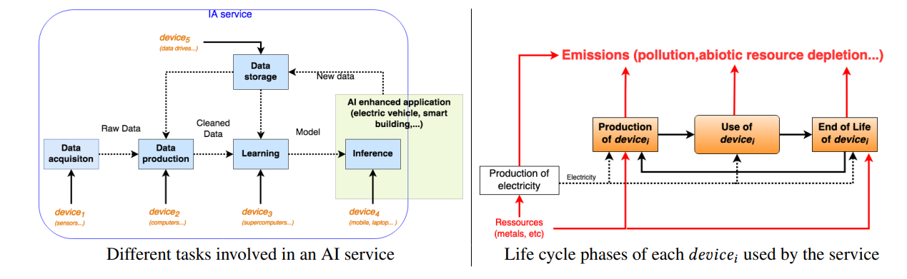

# 第12章 环境影响

在本章中，首先提出一个问题：大语言模型对环境的影响是什么？

这里给出的一个答案是：**气候变化**

一方面，我们都听说过气候变化的严重影响([文章1](https://www.cnn.com/2021/09/17/us/catastrophic-climate-change-un-report/index.html)、[文章2]("https://climate.nasa.gov/effects/))：
- 我们已经比工业革命前的水平高出1.2°C
- 需要保持在1.5°C以下以避免气候危机
- 根据目前的轨迹，在未来几十年内将达到2.7°C

另一方面，我们看到训练大语言模型所需的计算量大幅增加（从而导致二氧化碳排放）。以下是一些数据：
- [Strubell et al., 2018](https://arxiv.org/pdf/1906.02243.pdf)估计，训练排放了626,000磅二氧化碳（5辆汽车终生的排放量）。
- DeepMind的[Gopher](https://arxiv.org/pdf/2112.11446.pdf)报告称，训练产生的二氧化碳估计为380吨。

本章将学习如何将大语言模型与环境影响联系起来。

学习目标：
- 全面了解大语言模型对环境的影响。
- 能够计算训练特定语言模型产生的排放量。
- 提高对监测和减轻（负面）环境影响的认识，甚至承担个人责任。

注意事项：
- 本章的重点是了解（环境）成本。大语言模型大幅提升了效果，但是需要考虑成本。如何做到这一点非常具有挑战性。
- 与此同时，世界人口的收益和成本往往非常不均衡，成本“不成比例地落在穷人和弱势群体身上”。
- 所提供的所有数字都是估计，因为：
    - 缺乏对数据中心的监控和信息
    - 这些信息通常是私有的
    - 很难用摊余成本进行信用/责任分配（例如，建立数据中心+训练多个模型，训练一个模型+使其适配许多下游任务）。

## 12.1 生命周期评估

本节主要基于[Ligozat et al. (2021)](https://arxiv.org/pdf/2110.11822.pdf)的论文，从多个角度进行探讨语言模型/AI对气候影响的内容：

从**哲学角度**来说，大多数关于人工智能和机器学习对环境影响的工作都集中在温室气体排放（受气候变化启发）上，但更重要的是（尽管很难）采取系统方法来思考：
- 对环境的全面影响（排放、水足迹）
- IT设备的整个生命周期（例如，生产、使用、寿命终止）

从**生命周期评估（LCA）**的角度来说：
- 生命周期评估（LCA）（ISO 14040和14044）为实现这一点提供了一个框架。
- 需要“从系统的角度”来避免“一个问题的解决方案会产生几个新的、经常被忽视的问题”。

从**IT设备的生命周期**来说：
- 生产：
    - 原材料提取：提取矿石以及转化为金属的所有过程
    - 制造：包括制造设备的所有过程
    - 运输：设备运输过程
- 使用：设备的实际能耗
- 寿命终止：拆除、回收/处置设备

此时要对**生命周期中的注意事项**做一下说明：
- 生产
    - 我们没有针对GPU/TPU的生命周期评估
    - 法国仅使用CPU的数据中心：40%的温室气体排放源于生产阶段（[Berthoud et al. 2020](https://hal.archives-ouvertes.fr/hal-02549565v4)）
    - 数据中心的建立有很多目的，需要进行信用分配，以确定由于大型语言模型（由于情况变化很快，很难提前估计）所占的份额。
    - 示例：制造占iPhone 5总排放量的75%

- 使用
    - 主要取决于能源（煤炭或水电）的碳强度

- 生命的终结
    - 通常没有很好的记录
    - 80%的电子设备未被正式回收

特别地，在使用阶段：
- 数据：需要获取、生成和存储数据
- 学习：训练大语言模型
    - 这包括实验和超参数调整。
    - 这是“一次性成本”，直到您需要再次更新模型。

- 推理：在生产中运行模型
    - 示例：谷歌每天收到56亿次搜索查询（[来源](https://blog.hubspot.com/marketing/google-search-statistics)）。

    - 通常部署的是从大模型中蒸馏出来的小得多的模型（如果特定于任务，则可以小得更多）。
    - 如果你需要进行多个预测（例如，情感、主题分类等），可以对句子进行一次编码（例如，BERT），并使用不同的任务特定的分类头。

从**环境影响**的角度来说：
- 温室气体排放：导致气候变化
- 水足迹：淡水在一些地区是稀缺资源
    - 数据中心使用水进行冷却（需要电力）
    - 发电是第二大用水需求，处理水和废水需要电力

- [对人类的危害](https://lc-impact.eu/HHhuman_toxicity.html)：释放到环境中（空气、水、土壤）的化学物质，可导致癌症等。
    - 芯片制造在制造种产生有毒废料

- 非生物资源枯竭
    - 化石燃料
    - 用于制造电子设备的矿物（锂、钴）。您可以通过[此链接](https://iopscience.iop.org/article/10.1088/1748-9326/abfba1/pdf)了解更多关于数据中心对环境的影响。

其他二阶效应（[更多细节](https://crfm.stanford.edu/assets/report.pdf#environment)）：
- 更高的效率创造更多的需求（[反弹效应](https://en.wikipedia.org/wiki/Rebound_effect_(conservation))和[杰文悖论](https://en.wikipedia.org/wiki/Jevons_paradox)）
- 环境变化（荒漠化加速，灭绝率上升）
- 冻土融化反过来又加速了温室气体排放
- 芯片短缺导致汽车制造业停工

$$
\text{language model} \quad\Rightarrow\quad \text{compute} \quad\Rightarrow\quad \text{energy use} \quad\Rightarrow\quad \text{greenhouse gas emissions} \quad\Rightarrow\quad \text{environmental impact}
$$

## 12.2 气候变化

虽然考虑整个生命周期很重要，但我们将主要关注气候变化和温室气体排放，因为这是大部分研究人工智能和机器学习对环境的影响所关注的。

气温正在上升：

- 自1900年以来，平均表面温度增加了2.14˚F（1.19˚C）。
- 自2005年以来，出现了10个最热年份。
- 温度随时间增加（[来源](https://www.climate.gov/news-features/understanding-climate/climate-change-global-temperature)）：

负面影响：
- 自然灾害增加（极端热浪、洪水、干旱、野火）
- 海平面上升破坏沿海社区和野生动物生态系统

原因：
- 排放到大气中的[温室气体](https://www.epa.gov/ghgemissions/overview-greenhouse-gases)（二氧化碳、甲烷、一氧化二氮）锁住了太阳的热量（过去80万年的[相关性](https://www.ncei.noaa.gov/sites/default/files/2021-11/8%20-%20Temperature%20Change%20and%20Carbon%20Dioxide%20Change%20-%20FINAL%20OCT%202021.pdf)）
- 自1970年以来增长了90%（[来源](https://www.epa.gov/ghgemissions/global-greenhouse-gas-emissions-data)）

- 人类活动加速：
    - 燃烧化石燃料（煤、石油、天然气）发电、制造、运输（汽车、卡车、船舶、飞机）
    - 种植作物（肥料）
    - 砍伐森林（例如，建立农场）

碳排放量的计量单位为kg CO2 eq：

- 每种温室气体都具有[全球变暖潜力](https://en.wikipedia.org/wiki/Global_warming_potential)（GWP）：
    - 取决于（i）吸收的热量和（ii）它在大气中停留的时间。
    - 对于二氧化碳，全球升温潜能值=1（定义为参考值）。
    - 对于甲烷，100年全球升温潜能值=25。
    - 对于一氧化二氮，全球升温潜能值在100年内为300（因为它存在的时间太长了——121年）。

## 12.3 能源使用和温室气体排放

到目前为止，我们已经讨论了温室气体排放及其对气候变化的影响，气候变化是环境影响的一种特别突出的形式。数据中心使用能源（以电力的形式）。这是如何映射到排放量上的？答案是，这取决于电力是如何产生的。

**碳强度（Carbon intensity:）**：使用每千瓦时能源排放的碳量（[来源](https://lowcarbonpower.org/blog/emissions)）
- 化石燃料（煤、天然气）产生的排放量最多（来自直接排放）
- 如果考虑到整个生命周期（发电厂建设、采矿、废物管理），其他绿色能源（太阳能、风能）也会产生排放
- 在魁北克运行同样的任务（水电）的排放量将比爱沙尼亚（煤炭）少30倍

来自[Lacoste et al. (2019)](https://arxiv.org/pdf/1910.09700.pdf)：

[de Chalendar et al. 2019](https://www.pnas.org/content/pnas/116/51/25497.full.pdf)

- 取决于位置（那里有什么类型的发电厂）
- 取决于时间效应（季节、一天中的时间）
- 电力交换意味着它更难追踪，负面影响往往在其他地方
- 加利福尼亚州main Balancing Authority（BA）40%的排放是在其他地方产生的

**数据中心**统计数字 ([Md Abu Bakar Siddik et al., 2021](https://iopscience.iop.org/article/10.1088/1748-9326/abfba1/pdf))：

- 2018年，全球数据中心用电量为2050亿千瓦时（占总用电量的1%）。
- 在美国，2014年数据中心用电量占总用电量的1.8%。
- 30%的数据中心位于美国。
- 美国温室气体排放总量的0.5%来自于于数据中心。
- 好消息：从2010年到2018年，计算量增加了550%，但电力消耗仅增加了6%（由于能源效率的提高）。

## 12.4 估算训练模型的排放量

现在让我们试着计算训练所需的能源使用量，从而计算温室气体排放量。

### 12.4.1 ML CO2 Impact Calculator

[ML CO2 Impact Calculator](https://mlco2.github.io/impact/)（[Lacoste et al., 2019]("https://arxiv.org/pdf/1910.09700.pdf)）提供了一种基于硬件、使用的小时数、供应商和地区来估计排放量的简单方法。

### 12.4.2 [Strubell et al., 2018](https://arxiv.org/pdf/1906.02243.pdf)

这是第一篇真正激发NLP社区对环境影响认识的论文。

计算功耗（kWh）：

- $p_\text{cpu}$：CPU的平均功率（W）
- $p_\text{gpu}$：GPU的平均功率（W）
- $p_\text{dram}$：DRAM的平均功率（W）
- $\text{PUE}$：用电效率：提供给数据中心的总功率/IT设备消耗的功率

$$
\text{emissions} = R_{\text{power} \to \text{emit}} \text{PUE} (p_\text{cpu} + p_\text{gpu} + p_\text{dram})
$$

它们的平均值：
- $\text{PUE}=1.58$（2018年全球数据中心平均值）
- $R_{\text{power} \to \text{emit}}=0.954$（2018年平均排放量-磅/千瓦时）

**结果**
- BERT-base（110M参数）：1438 lbs CO2eq
    - NVIDIA在64个V100 GPU上训练79.2小时

- 神经结构搜索（213M参数）以获得Evolved Transformer [So et al. (2019)](https://arxiv.org/pdf/1901.11117.pdf)：626155 lbs CO2eq
    - 基模型在一个TPUv2上训练需要10个小时（300K步）
    - 训练一共需要32623小时（979M步）

- 1名乘客乘坐从纽约到旧金山的往返航班：1984 lbs CO2eq（0.9吨）
- 汽车生命周期：126,000 lbs CO2eq

### 12.4.3 [Patterson et al., 2021](https://arxiv.org/pdf/2104.10350.pdf)
简单形式：
$$
\text{emissions} = R_{\text{power} \to \text{emit}} (\text{energy-train} + \text{queries} \cdot \text{energy-inference})
$$

- NVIDIA：80%的ML工作负载是推理，而不是训练

许多设计决策：
- 模型架构：Transformer与Evolved Transformer
- 处理器：NVIDIA的P100与Google的TPU
- 数据中心：平均（1.58）与谷歌（1.11）
- 能源供应组合（如煤炭、水电）：平均（0.429千克二氧化碳/千瓦时）与谷歌（0.080千克二氧化碳/千瓦时）
    - 注：总额为0.478，净额为0.080
    - 扣除出售给其他公司的清洁能源

对于训练：

$$
\text{emissions} = \text{hours-to-train} \cdot \text{num-processors} \cdot \text{power-per-processor} \cdot \text{PUE} \cdot R_{\text{power} \to \text{emit}}
$$

不同模型的估计值：
- T5：86 MWh，47t CO2eq
- GShard（用于机器翻译的MOE模型）：24 MWh，4.3t CO2eq
- Switch Transformer：179 MWh，59t CO2eq
- GPT3：1287 MWh，552t CO2eq

反驳Strubell et al. (2019)的神经结构搜索的估计值：
- 对于搜索小任务，18.7x太高
- 神经结构搜索只需一次，然后每个人都可以使用Evolved Transformer
- 排放量被高估了88倍

要点：
- 如果可能的话，测量比在线计算更好
- 谷歌使用了12.2t 千瓦时（训练谷歌最大的4个模型不到0.005%）
- 这是比特币挖矿计算支出的1/10

## 12.5 推荐的Python包

- [Environment Impact Tracker](https://github.com/Breakend/experiment-impact-tracker)
- [Carbon Tracker](https://github.com/lfwa/carbontracker)
- [CodeCarbon](https://github.com/mlco2/codecarbon)

## 12.6 总结

- 环境影响是一个巨大的话题。一切都是相互联系的，所以很难得出一个干净的定量指标。但要真正着眼于全局。
- 尽管如今大语言模型的还很少，但它正在快速增长。
- 大语言模型的通用性提供了节省成本的潜力（“一次性训练”并适用于许多不同的任务）。但它们的成本要高得多，需要可能需要重新训练。这里的权衡是什么？

- **缓解措施**：
    - 尝试在使用清洁能源的数据中心训练模型
    - 碳抵消的效果各不相同（森林种植活动产生单一种植）
    - 更高效的模型架构、训练程序、硬件（但要注意反弹效应）

- **在论文报告排放量**：
    - 可以提高认识（想象一下，如果每一篇论文都能报告排放量）
    - 调整激励（人们目前关注准确性，但碳排放也很重要！）

## 延伸阅读

- [Foundation models report (environment section](https://crfm.stanford.edu/assets/report.pdf#environment)

- [Energy and Policy Considerations for Deep Learning in NLP](https://arxiv.org/pdf/1906.02243.pdf). Emma Strubell, Ananya Ganesh, A. McCallum. ACL 2019.

- [Quantifying the Carbon Emissions of Machine Learning](https://arxiv.org/pdf/1910.09700.pdf). Alexandre Lacoste, Alexandra Luccioni, V. Schmidt, Thomas Dandres. 2019. Introduces ML Carbon Emissions Calculator.

- [Towards the Systematic Reporting of the Energy and Carbon Footprints of Machine Learning](https://arxiv.org/pdf/2002.05651.pdf). Peter Henderson, Jieru Hu, Joshua Romoff, Emma Brunskill, Dan Jurafsky, Joelle Pineau. 2020. Introduces the environment impact tracker tool.

- [Carbon Emissions and Large Neural Network Training](https://arxiv.org/pdf/2104.10350.pdf). David Patterson, Joseph Gonzalez, Quoc V. Le, Chen Liang, Lluís-Miquel Munguía, D. Rothchild, David R. So, Maud Texier, J. Dean. 2021. From Google.

- [Sustainable AI: Environmental Implications, Challenges and Opportunities](https://arxiv.org/pdf/2111.00364.pdf). Carole-Jean Wu, R. Raghavendra, Udit Gupta, Bilge Acun, Newsha Ardalani, Kiwan Maeng, Gloria Chang, Fiona Aga Behram, James Huang, Charles Bai, M. Gschwind, Anurag Gupta, Myle Ott, Anastasia Melnikov, Salvatore Candido, David Brooks, Geeta Chauhan, Benjamin Lee, Hsien-Hsin S. Lee, Bugra Akyildiz, Maximilian Balandat, Joe Spisak, R. Jain, M. Rabbat, K. Hazelwood. 2021. From Facebook.

- [Unraveling the hidden environmental impacts of AI solutions for environment](https://arxiv.org/pdf/2110.11822.pdf). Anne-Laure Ligozat, J. Lefèvre, A. Bugeau, Jacques Combaz. 2021.

- [The environmental footprint of data centers in the United States](https://iopscience.iop.org/article/10.1088/1748-9326/abfba1/pdf).

