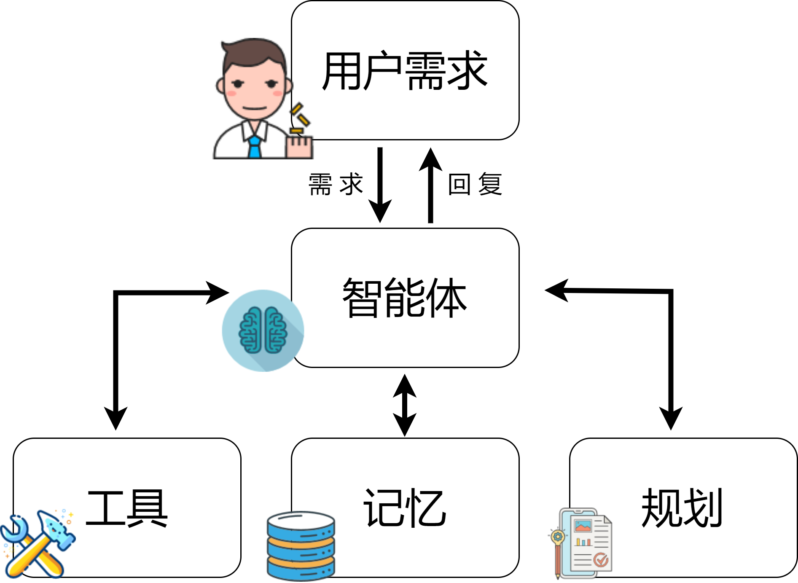
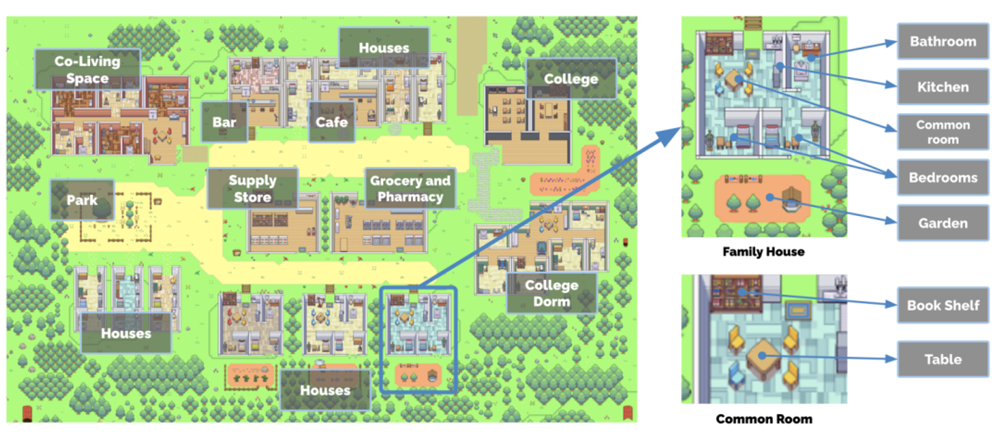
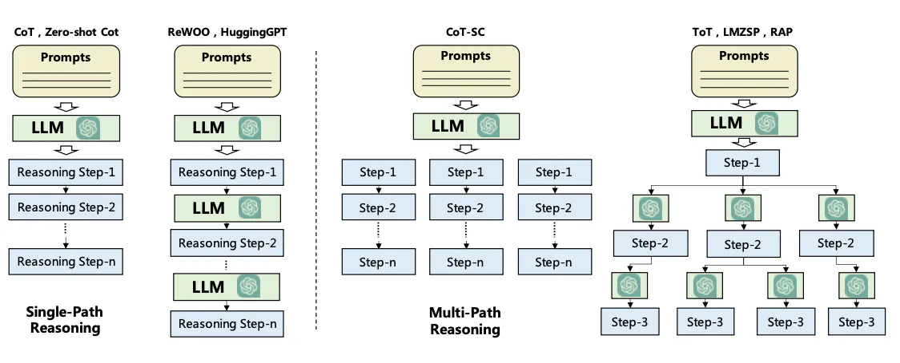
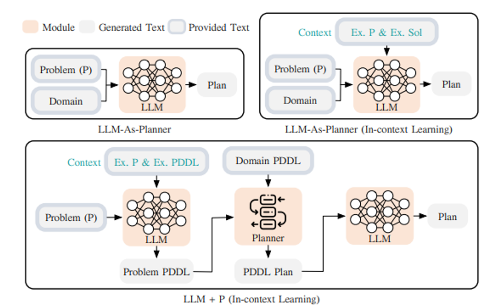
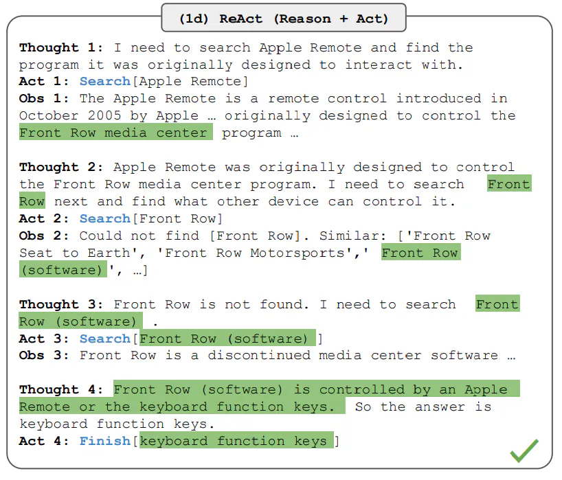
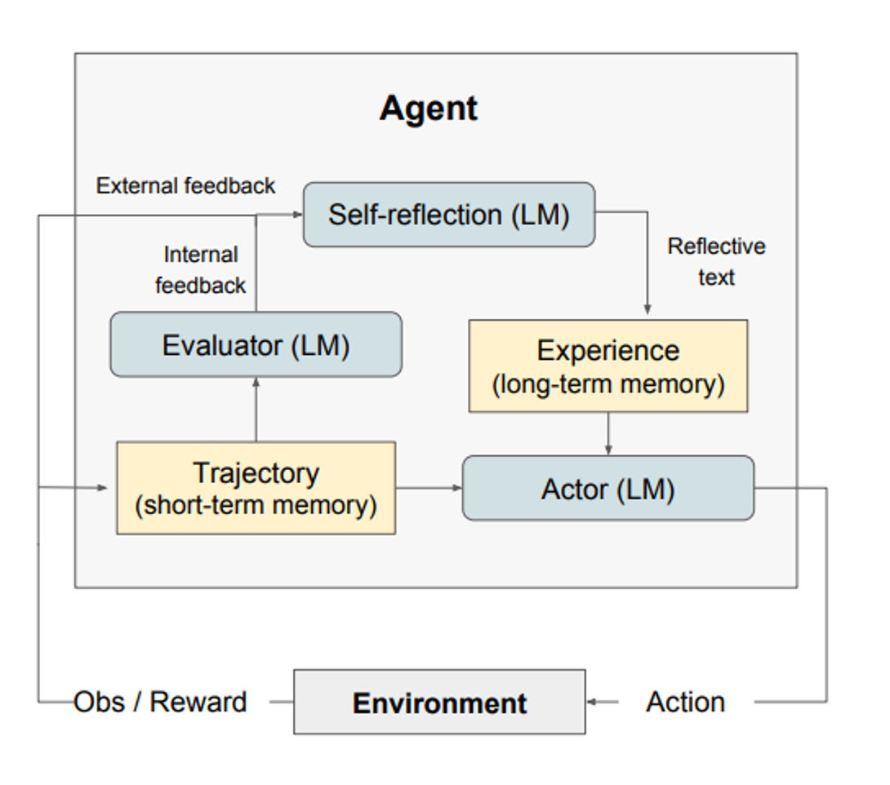
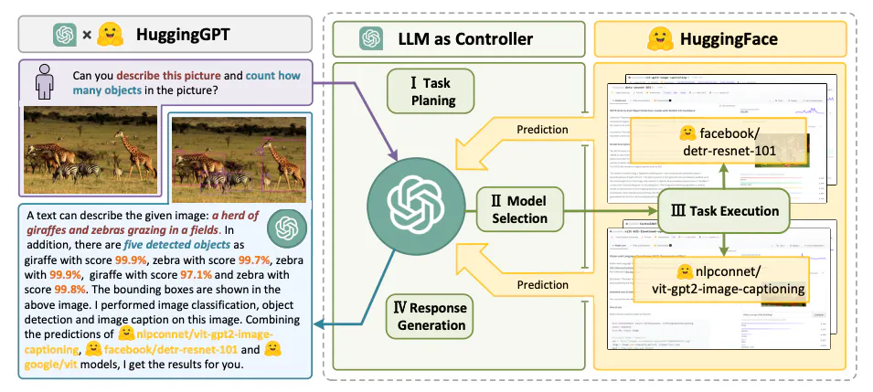

## 基于大模型的智能体(Agent)

# 简介

在科技发展的历史中，人类一直期望追求智能化的实现，由此的幻想早已先行，有《机器人总动员》中的瓦力，有《终结者》中的T-800，也有《最后的问题》中的「模」，人们试图打造一种可以自主完成预设目标的代理或实体，即智能体 (AI Agents 或 Agents)，以协助人类完成各种各样繁琐的任务。多年来，智能体作为人工智能一个活跃的应用领域吸引人们不断地研究探索。如今，大语言模型正蓬勃发展，日新月异。在智能体技术的实现上，尤其是在基于大型语言模型（LLM）的智能体构建中，LLM在智能体的智能化中扮演着至关重要的角色。这些智能体能够通过整合LLM与规划、记忆以及其他关键技术模块，执行复杂的任务。在此框架中，LLM充当核心处理单元或“大脑”，负责管理和执行为特定任务或响应用户查询所需的一系列操作。
以一个新的例子来展示LLM智能体的潜力，设想我们需要设计一个系统来应对以下询问：
当前欧洲最受欢迎的电动汽车品牌是什么？
这个问题可直接由一个更新至最新数据的LLM给出答案。若LLM缺乏即时数据，可以借助一个RAG（检索增强生成）系统，其中LLM可以访问最新的汽车销售数据或市场报告。
现在，让我们考虑一个更为复杂的查询：
> 过去十年里，欧洲电动汽车市场的增长趋势如何，这对环境政策有何影响？能否提供这一时期内市场增长的图表？
> 
仅依赖LLM来解答此类复杂问题是不够的。虽然结合LLM与外部知识库的RAG系统能提供某种帮助，但要全面回答这个问题，还需要更进一步的操作。这是由于要解答这个问题，首先需要将其拆解成多个子问题，其次需要并通过特定的工具和流程进行解决，最终获得所需答案。一个可能的方案是开发一个能够访问最新的环境政策文献、市场报告以及公开数据库的LLM智能体，以获取关于电动汽车市场增长及其环境影响的信息。
此外，LLM智能体还需配备“数据分析”工具，这可以帮助智能体利用收集到的数据制作出直观的图表，从而清晰地展示过去十年欧洲电动汽车市场的增长趋势。虽然这种智能体的高级功能目前还属于理想化设想，但它涉及多项重要的技术考量，如制定解决方案的规划和可能的记忆模块，这有助于智能体追踪操作流程、监控和评估整体进展状态。

# LLM Agent 架构

一般而言，基于LLM的智能体框架包括以下核心组件：
- 用户请求 - 用户的问题或请求
- 智能体/大脑 - 充当协调者的智能体核心
- 规划 - 协助智能体规划未来的行动
- 记忆 - 管理智能体的过往行为
    

    

## 智能体

在构建以大型语言模型（LLM）为核心的智能体系统中，LLM是至关重要的，充当系统的主脑和多任务协调的核心。这种智能体通过解析和执行基于提示模板的指令，这些模板不仅指导LLM具体操作，也详细定义了智能体的角色和人格，包括背景、性格、社会环境及人口统计信息等。这种人格化的描述使得智能体能更精准地理解和执行任务。
为了优化这一过程，系统设计需要综合考虑几个关键方面：
- 首先，系统需具备丰富的上下文理解和持续学习能力，不仅处理和记忆大量交互信息，还需不断优化执行策略和预测模型。
- 其次，引入多模态交互，融合文本、图像、声音等多种输入输出形式，让系统更自然有效地处理复杂任务和环境。此外，智能体的动态角色适应和个性化反馈也是提升用户体验和执行效率的关键。
- 最后，加强安全性和可靠性，确保系统稳定运行，赢得用户信任。
整合这些元素，基于LLM的智能体系统能够在处理特定任务时展现出更高的效率和准确性，同时，在用户交互和系统长期发展方面展现出更强的适应性和可持续性。这种系统不仅仅是执行命令的工具，更是能够理解复杂指令、适应不同场景并持续优化自身行为的智能合作伙伴。

## 规划

### 无反馈规划

规划模块是智能体理解问题并可靠寻找解决方案的关键，它通过分解为必要的步骤或子任务来回应用户请求。任务分解的流行技术包括思维链（COT）和思维树（TOT），分别可以归类为单路径推理和多路径推理。

首先，我们介绍“思维链（COT）”的方法，它通过分步骤细分复杂问题为一系列更小、更简单的任务，旨在通过增加计算的测试时间来处理问题。这不仅使得大型任务易于管理，而且帮助我们理解模型如何逐步解决问题。

接下来，有研究者在此基础上提出了思维树（TOT）”方法，通过在每个决策步骤探索多个可能的路径，形成树状结构图。这种方法允许采用不同的搜索策略，如宽度优先或深度优先搜索，并利用分类器来评估每个可能性的有效性。

为了进行任务分解，可以通过不同的途径实现，包括直接利用LLM进行简单提示、采用针对特定任务的指令，或者结合人类的直接输入。这些策略能够根据不同的需求，灵活调整任务的解决方案。而另一种方法则是结合了经典规划器的LLM（简称为LLM+P），该策略依赖外部规划器来进行长期规划。这种方法首先将问题转化为PDDL格式，然后利用规划器生成解决方案，最终将这一解决方案转化回自然语言。这适用于需要详细长期规划的场景，尽管依赖特定领域的PDDL和规划器，可能限制了其适用范围。

这些创新方法不仅展示了解决问题的多样性和灵活性，也为我们提供了深入理解LLM如何处理复杂任务的新视角。
### 有反馈规划

上述规划模块不涉及任何反馈，这使得实现解决复杂任务的长期规划变得具有挑战性。为了解决这一挑战，可以利用一种机制，使模型能够根据过去的行动和观察反复思考和细化执行计划。目标是纠正并改进过去的错误，这有助于提高最终结果的质量。这在复杂的现实世界环境和任务中尤其重要，其中试错是完成任务的关键。这种反思或批评机制的两种流行方法包括[ReAct](https://github.com/ysymyth/ReAct)和[Reflexion](https://github.com/noahshinn/reflexion)。

[ReAct](https://github.com/ysymyth/ReAct)方法提出通过结合特定任务的离散动作与语言描述，实现了在大规模语言模型（LLM）中融合推理与执行的能力。离散动作允许LLM与其环境进行交互，如利用Wikipedia搜索API，而语言描述部分则促进了LLM产生基于自然语言的推理路径。这种策略不仅提高了LLM处理复杂问题的能力，还通过与外部环境的直接交互，增强了模型在真实世界应用中的适应性和灵活性。此外，基于自然语言的推理路径增加了模型决策过程的可解释性，使用户能够更好地理解和校验模型行为。ReAct设计亦注重模型行动的透明度与控制性，旨在确保模型执行任务时的安全性与可靠性。因此，ReAct的开发为大规模语言模型的应用提供了新视角，其融合推理与执行的方法为解决复杂问题开辟了新途径。

[Reflexion](https://github.com/noahshinn/reflexion)是一个框架，旨在通过赋予智能体动态记忆和自我反思能力来提升其推理技巧。该方法采用标准的强化学习（RL）设置，其中奖励模型提供简单的二元奖励，行动空间遵循ReAct中的设置，即通过语言增强特定任务的行动空间，以实现复杂的推理步骤。每执行一次行动后，智能体会计算一个启发式评估，并根据自我反思的结果，可选择性地重置环境，以开始新的尝试。启发式函数用于确定轨迹何时效率低下或包含幻觉应当停止。效率低下的规划指的是长时间未成功完成的轨迹。幻觉定义为遭遇一系列连续相同的行动，这些行动导致在环境中观察到相同的结果。

## 记忆

记忆模块是智能体存储内部日志的关键组成部分，负责存储过去的思考、行动、观察以及与用户的互动。它对于智能体的学习和决策过程至关重要。根据LLM智能体文献，记忆可分为两种主要类型：短期记忆和长期记忆，以及将这两种记忆结合的混合记忆，旨在提高智能体的长期推理能力和经验积累。

- 短期记忆 - 关注于当前情境的上下文信息，是短暂且有限的，通常通过上下文窗口限制的学习实现。
- 长期记忆 - 储存智能体的历史行为和思考，通过外部向量存储实现，以便快速检索重要信息。
- 混合记忆 -通过整合短期和长期记忆，不仅优化了智能体对当前情境的理解，还加强了对过去经验的利用，从而提高了其长期推理和经验积累的能力。
- 
在设计智能体的记忆模块时，需要根据任务需求选择合适的记忆格式，如自然语言、嵌入向量、数据库或结构化列表等。这些不同的格式对智能体的信息处理能力和任务执行效率有直接影响。

## 工具

工具使大型语言模型（LLM）能够通过外部环境（例如Wikipedia搜索API、代码解释器和数学引擎）来获取信息或完成子任务。这包括数据库、知识库和其他外部模型的使用，极大地扩展了LLM的能力。在我们最初的与汽车销量相关的查询中，通过代码实现直观的图表是一个使用工具的例子，它执行代码并生成用户请求的必要图表信息。

LLM以不同方式利用工具：

- [MRKL](https://arxiv.org/abs/2205.00445)：是一种用于自主代理的架构。MRKL系统旨在包含一系列“专家”模块，而通用的大型语言模型（LLM）作为路由器，将查询引导至最合适的专家模块。这些模块既可以是大模型，也可以是符号的（例如数学计算器、货币转换器、天气API）。他们以算术为测试案例，对LLM进行了调用计算器的微调实验。实验表明，解决口头数学问题比解决明确陈述的数学问题更困难，因为大型语言模型（7B Jurassic1-large模型）未能可靠地提取出基本算术运算所需的正确参数。结果强调，当外部符号工具可以可靠地工作时，知道何时以及如何使用这些工具至关重要，这由LLM的能力决定。
- [Toolformer](https://arxiv.org/abs/2302.04761)：这个学术工作是训练了一个用于决定何时调用哪些API、传递什么参数以及如何最佳地将结果进行分析的大模型。这一过程通过微调的方法来训练大模型，仅需要每个API几个示例即可。该工作集成了一系列工具，包括计算器、问答系统、搜索引擎、翻译系统和日历。Toolformer在多种下游任务中实现了显著提升的零次学习（zero-shot）性能，经常与更大的模型竞争，而不牺牲其核心的语言建模能力。
- 函数调用（Function Calling）： 这也是一种增强大型语言模型（LLM）工具使用能力的策略，它通过定义一系列工具API，并将这些API作为请求的一部分提供给模型，从而使模型能够在处理文本任务时调用外部功能或服务。这种方法不仅扩展了LLM的功能，使其能够处理超出其训练数据范围的任务，而且还提高了任务执行的准确性和效率。
- [HuggingGPT](https://github.com/microsoft/JARVIS) ：  它是由大型语言模型（LLM）驱动的，设计用来自主处理一系列复杂的人工智能任务。HuggingGPT融合了LLM的能力和机器学习社区的资源，例如ChatGPT与Hugging Face的结合，使其能够处理来自不同模态的输入。具体来说，LLM在这里扮演着大脑的角色，一方面根据用户请求拆解任务，另一方面依据模型描述选择适合的模型执行任务。通过执行这些模型并将结果整合到计划的任务中，HuggingGPT能自主完成复杂的用户请求。这个过程展示了从任务规划到模型选择，再到任务执行，最后是响应生成的完整流程。首先，HuggingGPT利用ChatGPT分析用户的请求以理解他们的意图，并将其分解为可能的解决方案。接下来，它会选择Hugging Face上托管的、最适合执行这些任务的专家模型。每个选定的模型被调用并执行，其结果将反馈给ChatGPT。最终，ChatGPT将所有模型的预测结果集成起来，为用户生成响应。HuggingGPT的这种工作方式不仅扩展了传统单一模式处理的能力，而且通过其智能的模型选择和任务执行机制，在跨领域任务中提供了高效、准确的解决方案。

这些策略和工具的结合不仅增强了LLM与外部环境的交互能力，也为处理更复杂、跨领域的任务提供了强大的支持，开启了智能体能力的新篇章。
# Agent的挑战：

构建基于大型语言模型（LLM）的智能体是一个新兴领域，面临着众多挑战和限制。以下是几个主要的挑战及可能的解决方案：

- 角色适应性问题: 智能体需要在特定领域内有效工作，对难以表征或迁移的角色，可以通过针对性地微调LLM来提高性能。这包括代表非常见角色或心理特征的能力提升。
- 上下文长度限制: 有限的上下文长度限制了LLM的能力，尽管向量存储和检索提供了访问更大知识库的可能性。系统设计需要创新，以在有限的通信带宽内有效运作。
- 提示的鲁棒性: 智能体的提示设计需要足够鲁棒，以防微小的变化导致可靠性问题。可能的解决方案包括自动优化调整提示或使用LLM自动生成提示。
- 知识边界的控制: 控制LLM的内部知识，避免引入偏见或使用用户不知道的知识，是一个挑战。这要求智能体在处理信息时更加透明和可控。
- 效率和成本问题: LLM处理大量请求时的效率和成本是重要考量因素。优化推理速度和成本效率是提升多智能体系统性能的关键。

总的来说，基于LLM的智能体构建是一个复杂且多面的挑战，需要在多个方面进行创新和优化。持续的研究和技术发展对于克服这些挑战至关重要。
