# 引言

在AI领域，大模型的发展正以前所未有的速度推进技术的边界。
刚刚，Meta在官网上官宣了Llama-3，作为继Llama-1、Llama-2和Code-Llama之后的第三代模型，Llama 3在多个基准测试中实现了全面领先，性能优于业界同类最先进的模型。
纵观Llama系列模型，从版本1到3，展示了大规模预训练语言模型的演进及其在实际应用中的显著潜力。这些模型不仅在技术上不断刷新记录，更在商业和学术界产生了深远的影响。因此，对Llama模型不同版本之间的系统对比，不仅可以揭示技术进步的具体细节，也能帮助我们理解这些高级模型如何解决现实世界的复杂问题。

文本将详细梳理Llama开源家族的演进历程，包括：
- Llama进化史（第1节）
- 模型架构（第2节）
- 训练数据（第3节）
- 训练方法（第4节）
- 效果对比（第5节）
- 社区生态（第6节）
- 总结（第7节）

# 1. Llama进化史
本节将对每个版本的Llama模型进行简要介绍，包括它们发布的时间和主要特点。

## 1.1 Llama-1 系列
Llama-1 [1]是Meta在2023年2月发布的大语言模型，是当时性能非常出色的开源模型之一，有7B、13B、30B和65B四个参数量版本。
Llama-1各个参数量版本都在超过1T token的语料上进行了预训训练，其中，最大的65B参数的模型在2,048张A100 80G GPU上训练了近21天，并在大多数基准测试中超越了具有175B参数的GPT-3。

由于模型开源且性能优异，Llama迅速成为了开源社区中最受欢迎的大模型之一，以Llama为核心的生态圈也由此崛起。我们将在第6节对这一生态进行详细介绍。
与此同时，众多研究者将其作为基座模型，进行了继续预训练或者微调，衍生出了众多变体模型（见下图），极大地推动了大模型领域的研究进展。

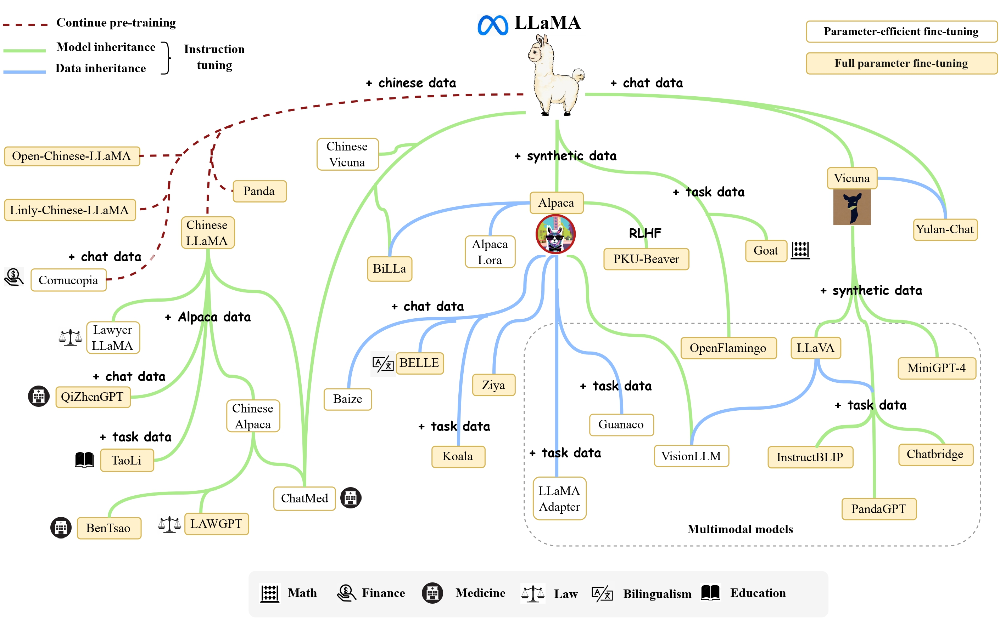

唯一的美中不足的是，因为开源协议问题，Llama-1不可免费商用。

## 1.2 Llama-2 系列
时隔5个月，Meta在2023年7月发布了免费可商用版本 Llama-2 [2]，有7B、13B、34B和70B四个参数量版本，除了34B模型外，其他均已开源。

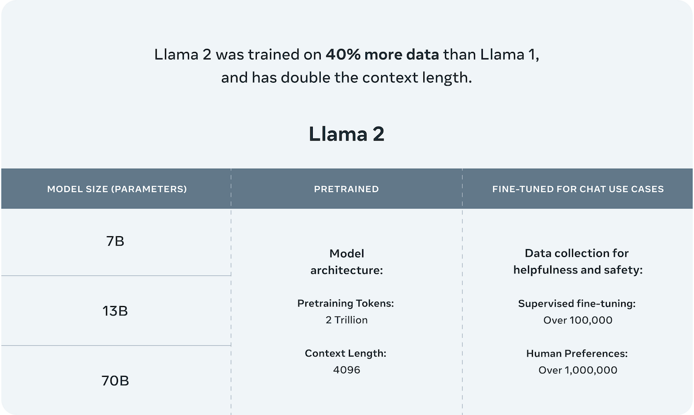

相比于Llama-1，Llama-2将预训练的语料扩充到了 2T token，同时将模型的上下文长度从2,048翻倍到了4,096，并引入了Multi-Query Attention (MQA）等技术。

有了更强大的基座模型Llama-2，Meta通过进一步的有监督微调（Supervised Fine-Tuning, SFT）、基于人类反馈的强化学习（Reinforcement Learning with Human Feedback, RLHF）等技术对模型进行迭代优化，并发布了面向对话应用的微调系列模型 Llama-2 Chat。

通过“预训练-有监督微调-基于人类反馈的强化学习”这一训练流程，Llama-2 Chat不仅在众多基准测试中取得了更好的模型性能，同时在应用中也更加安全。

随后，得益于Llama-2的优异性能，Meta在2023年8月发布了专注于代码生成的Code-Llama，共有7B、13B、34B和70B四个参数量版本。

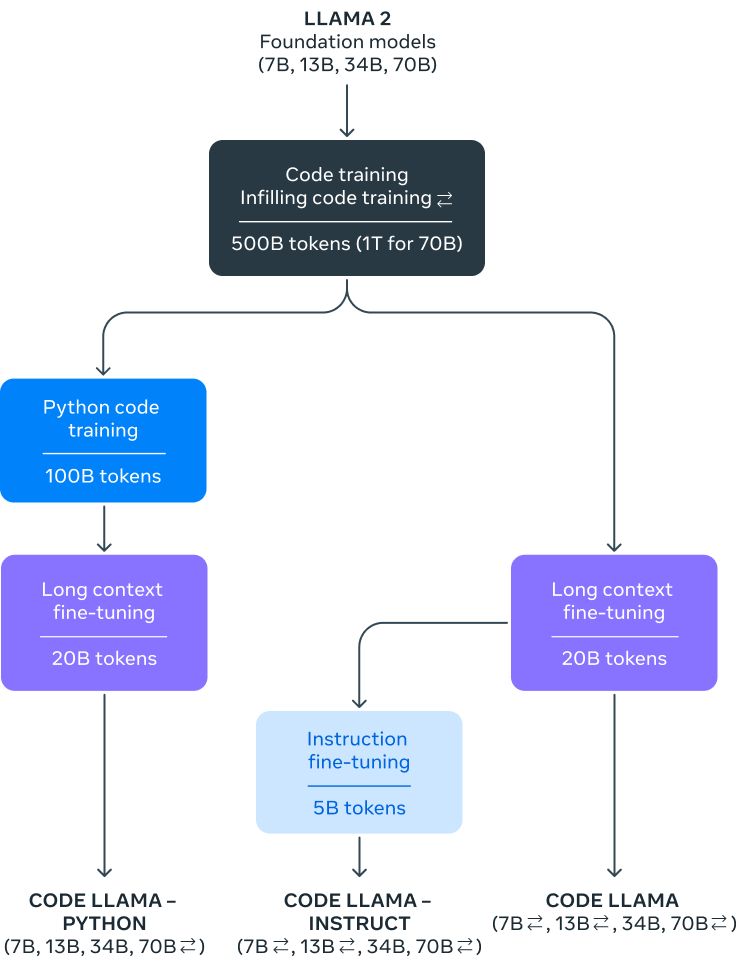

## 1.3 Llama-3 系列
2024年4月，Meta正式发布了开源大模型 Llama-3，包括8B和70B两个参数量版本。除此之外，Meta还透露，400B的Llama-3还在训练中。

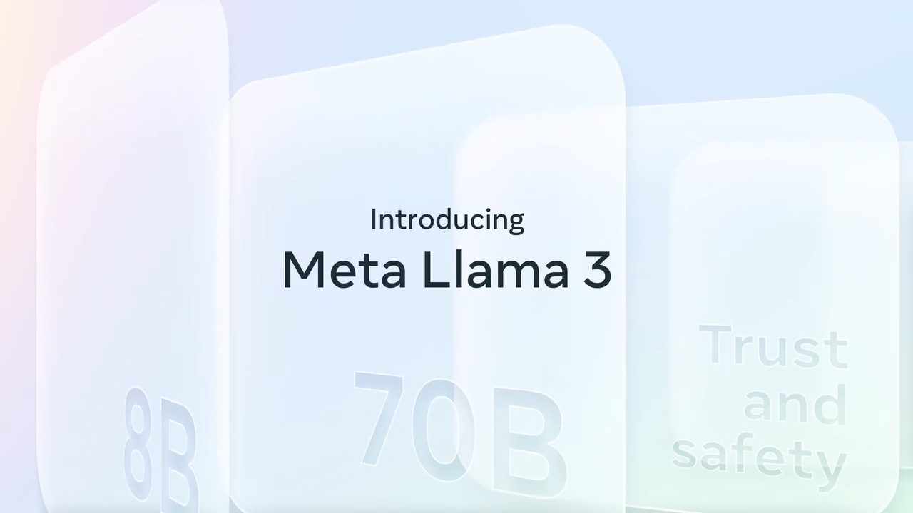

相比Llama-2，Llama-3支持8K长文本，并采用了一个编码效率更高的tokenizer，词表大小为128K。在预训练数据方面，Llama-3使用了超过15T token的语料，这比Llama 2的7倍还多。

Llama-3在性能上取得了巨大飞跃，并在相同规模的大模型中取得了最优异的性能。

另外，推理、代码生成和指令跟随等能力得到了极大的改进，使Llama 3更加可控。

# 2. 模型架构
本节将详细描述Llama的模型架构，包括神经网络的大小、层数、注意力机制等。

目前，主流的大语言模型都采用了Transformer[3]架构，它是一个基于多层自注意力（Self-attention）的神经网络模型。

原始的Transformer由编码器（Encoder）和解码器（Decoder）两个部分构成，同时，这两个部分也可以独立使用。

例如基于编码器的BERT [4]模型和基于解码器的GPT [5]模型。

Llama模型与GPT类似，也是采用了基于解码器的架构。在原始Transformer解码器的基础上，Llama进行了如下改动：

- 为了增强训练稳定性，采用前置的RMSNorm [6]作为层归一化方法。
- 为了提高模型性能，采用SwiGLU [7]作为激活函数。
- 为了更好地建模长序列数据，采用RoPE [8]作为位置编码。
- 为了平衡效率和性能，部分模型采用了分组查询注意力机制（Grouped-Query Attention, GQA）[9]。

具体来说，首先将输入的token序列通过词嵌入（word embedding）矩阵转化为词向量序列。然后，词向量序列作为隐藏层状态依次通过𝐿个解码器层，并在最后使用RMSNorm进行归一化。归一化后的隐藏层状态将作为最后的输出。

在每个解码器层中，输入的隐藏层状态首先通过RMSNorm归一化然后被送入注意力模块。注意力模块的输出将和归一化前的隐藏层状态进行残差连接。之后，新的隐藏层状态进行RMSNorm归一化，然后被送入前馈网络层。类似地，前馈网络层的输出同样进行残差连接，作为解码器层的输出。

每个版本的Llama由于其隐藏层的大小、层数的不同，均有不同的变体。接下来，我们将展开看下每个版本的不同变体。
## 2.1 Llama-1 系列

Llama-1 模型架构，详见[MODEL_CARD](https://github.com/meta-llama/llama/blob/main/MODEL_CARD.md)： 

[图片]

为了更好地编码数据，Llama-1使用BPE [10]算法进行分词，具体由sentencepiece进行实现。值得注意的是，Llama-1将所有数字分解为单独的数字，并对未知的UTF-8字符回退到字节进行分解。词表大小为32k。

## 2.2 Llama-2 系列

Llama-2 模型架构，详见MODEL_CARD（同上）

[图片]

Llama-2使用了和Llama-1相同的模型架构以及tokenizer。与Llama-1不同的是，Llama-2将上下文长长度扩展到了4k。

## 2.3 Llama-3 系列

Llama-3 模型架构，详见[MODEL_CARD](https://github.com/meta-llama/llama3/blob/main/MODEL_CARD.md)：

[图片]

与Llama 2相比，Llama-3将tokenizer由sentencepiece换成了tiktoken，这与GPT4 保持一致。同时，词表大小由32k扩展到了128k。另外，为了提高模型效率，Llama-3 8B和70B都采用了GQA。同时上下文长度也扩展到了8k。

# 3. 训练数据
本节将对每个版本的训练数据进行简要介绍，包括数据来源、规模和处理方式。

## 3.1 Llama-1 系列
Llama-1使用了海量无标注数据进行自监督学习，这些预训练数据由多个来源混合而成，且都是公开的数据。各个来源的数据量和采样比例见下表。

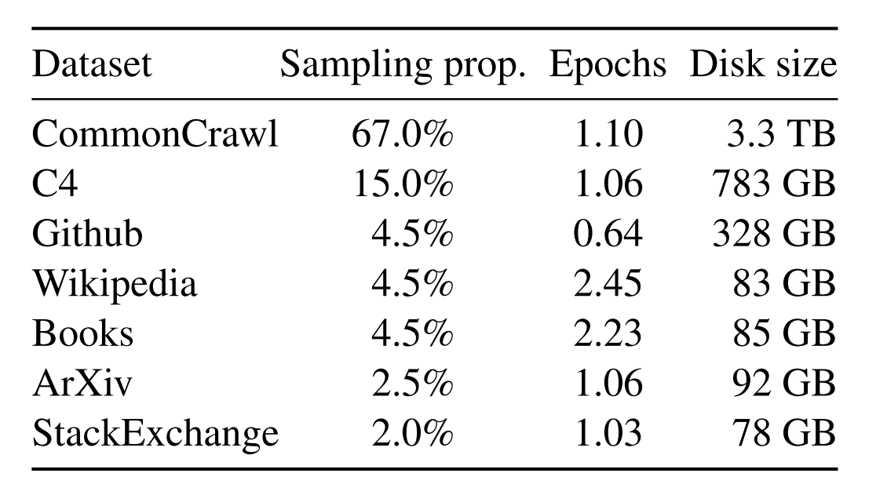

- 英语CommonCrawl：Llama-1预处理了2017年至2020年间的五个CommonCrawl数据集。该过程在行级别去重，使用fastText线性分类器进行语言识别以去除非英语页面，并使用n-gram语言模型过滤低质量内容。此外，Llama-1训练了一个线性模型来分类维基百科中用作参考的页面和随机采样的页面，并丢弃了未被分类为参考的页面。
- C4：在探索性实验中，Llama-1观察到使用多样化的预处理CommonCrawl数据集可以提升性能。因此，Llama-1的数据中包括了公开可获得的C4数据集。C4的预处理也包括去重和语言识别步骤：与CCNet的主要区别在于质量过滤，主要依赖于标点符号的存在或网页中的单词和句子数量等启发式规则。
- Github：Llama-1使用Google BigQuery上可公开获取的GitHub数据集。Llama-1仅保留在Apache、BSD和MIT许可下分发的项目。此外，Llama-1还使用基于行长度或字母数字字符比例的启发式规则过滤低质量文件，并用正则表达式移除如页眉等样板内容。最后，Llama-1在文件级别对结果数据集进行去重，匹配精确相同的内容。
- 维基百科：Llama-1添加了2022年6月至8月期间的维基百科数据，涵盖使用拉丁或西里尔文字的20种语言。Llama-1处理数据以移除超链接、评论和其他格式化的样板内容。
- Gutenberg和Books3：Llama-1在训练数据集中包括了两个书籍语料库：Gutenberg项目（包含公共领域的书籍）和ThePile的Books3部分，一个公开可获得的用于训练大型语言模型的数据集。Llama-1在书籍级别进行去重，移除超过90%内容重合的书籍。
- ArXiv ：Llama-1处理ArXiv的Latex文件，以增加科学数据到Llama-1的数据集。Llama-1移除了第一节之前的所有内容以及参考文献部分。Llama-1还移除了.tex文件中的注释，并内联扩展了用户编写的定义和宏，以增强论文间的一致性。
- Stack Exchange：Llama-1包括了Stack Exchange的数据转储，这是一个涵盖从计算机科学到化学等多种领域的高质量问题和答案的网站。Llama-1保留了28个最大网站的数据，移除了文本中的HTML标签，并根据得分将答案排序（从最高到最低）。

经过上述处理，Llama-1的整个训练数据集包含大约1.4T token。对于Llama-1的大部分训练数据，每个token在训练期间只使用一次，但维基百科和Books的数据进行了大约两个epoch的训练。

## 3.2 Llama-2

Llama-2 预训练使用了来自公开可用源的 2T个数据token（未详细指出具体的开源数据）。Llama-2-Chat 还在为此项目创建的27,540个提示-响应对上进行了额外的微调，其表现优于更大但质量较低的第三方数据集。为了实现AI对齐，使用了包含1,418,091个Meta示例和七个较小数据集的组合的人类反馈强化学习（RLHF）。在Meta示例中，平均对话深度为3.9，Anthropic Helpful 和 Anthropic Harmless集合为3.0，包括OpenAI Summarize、StackExchange等在内的其他五个集合的平均对话深度为1.0。微调数据包括公开可用的指令数据集以及超过一百万个新的人类标注示例。 

在预训练过程中，Llama-2对数据的安全性进行了全面考量。通过对预训练数据进行分析，Llama-2能够增加透明度，并发现潜在的问题根源，如潜在的偏见。Llama-2采取了一系列措施，包括遵循 Meta 公司的隐私和法律审查流程，排除已知含有大量个人信息的网站的数据。此外，Llama-2未对数据集进行额外的过滤，以使模型在各种任务中更广泛可用，同时避免过度清洗可能导致的意外人口统计消除。对于语言的代表性和毒性的分析，Llama-2使用了相应的工具和数据集，以了解预训练数据的特征，为模型的安全调整提供指导。这一过程确保了我们的模型在安全性方面得到了充分的考虑，并促使我们在部署模型之前进行了重要的安全调整。 

Llama 2的预训练主要集中在英语数据上，尽管实验观察表明模型在其他语言方面已有一定的熟练度，但由于非英语语言的预训练数据量有限，其熟练度受到限制（如下图所示）。因此，该模型在非英语语言中的性能仍然脆弱，应谨慎使用（说明多语言能力差：有可能是词表较小导致）。

[图片]

预训练数据截至到2022年9月，但某些调整数据较新，直到2023年7月。

在Llama2发布的技术报告中有说明：

> 我们将继续努力微调模型，以提高在其他语言环境下的适用性，并在未来发布更新版本，以解决这一问题。

当前Llama-3 不但扩充了词表大小而且增加了多语言的训练语料。从而完成了在Llama2在技术报告的承诺，而且在当前公布出来的多语言任务中获得了大幅度提升的性能。 

## 3.3 Llama-3 系列

为了更好训练Llama-3，研究人员精心设计了预训练语料库，这些不仅关注数量，还特别强调了质量。LLAMA-3其训练数据量大幅增加，从LLAMA-2的2T Tokens扩展到了15T Tokens，增长了约8倍。其中，代码数据扩充了4倍，显著提升了模型在代码能力和逻辑推理能力方面的表现。

LLAMA-3提供了三种规模的模型版本：小型模型具有8B参数，其性能略优于Mistral 7B和Gemma 7B；中型模型则拥有70B参数，其性能介于ChatGPT 3.5和GPT 4之间；大型模型规模达到400B，目前仍在训练中，旨在成为一个多模态、多语言版本的模型，预期性能应与GPT 4或GPT 4V相当。

值得注意的是，LLAMA-3并没有采用MOE（Mixture of Experts）结构，这种结构主要用于降低训练和推理成本，但在性能上通常无法与同规模的密集型（Dense）模型相比。随着模型规模的扩大，如何降低推理成本将成为一个需要关注的问题。

此外，LLAMA-3的训练数据包括了大量的代码token和超过5%的非英语token，来源于30多种语言。这不仅使得模型在处理英语内容时更加高效，也显著提升了其多语言处理能力，这表明LLAMA-3在全球多语言环境中的适应性和应用潜力。

为确保数据质量，Meta开发了一系列数据过滤pipeline，包括启发式过滤器、NSFW过滤器、语义重复数据删除技术及用于预测数据质量的文本分类器。这些工具的有效性得益于先前版本Llama的表现，特别是在识别高质量数据方面。

此外，Meta通过大量实验评估了在最终预训练数据集中混合不同来源数据的最佳策略，确保Llama-3能在多种场景下展现卓越性能，如日常琐事、STEM 领域、编程和历史知识等。

# 4. 训练方法
本节将对每个版本的训练方法进行简要介绍，包括预训练、有监督微调和基于人类反馈的强化学习。

## 4.1 Llama-1系列

Llama-1模型是一个基础的自监督学习模型，它没有经过任何形式的特定任务微调。自监督学习是一种机器学习技术，其中模型通过分析大量未标记的数据来预测其输入数据的某些部分。这种方法允许模型在没有人类标注的数据的情况下自动学习数据的内在结构和复杂性。Llama-1在公布的技术报告中详细描述了使用AdamW优化器的机器学习模型的具体训练配置。AdamW是对Adam优化器的改进，可以更有效地处理权重衰减，从而提高训练的稳定性。β1和β2参数的选择影响训练过程的收敛行为和稳定性。Llama-1描述的余弦学习率调度是一种有效的技术，用于在训练期间调整学习率，通过逐渐减少学习率，在某些情况下可以导致更好的收敛。实施0.1的权重衰减和1.0的梯度裁剪是预防过拟合和确保数值稳定性的标准做法。使用预热步骤是一种策略性方法，旨在训练过程初期稳定训练动态。根据模型大小调整学习率和批量大小是一种优化资源分配和效率的实用方法，有可能提高模型性能。

Llama-1也展示了一系列针对大规模语言模型训练进行的优化措施。通过使用xformers库[12]中的causal multi-head attention（通过不存储注意力权重和不计算由于语言建模任务的因果性质而被屏蔽的key/query.分数来实现的）的高效实现，减少了内存占用和计算时间，显示了在处理大量数据时对效率的关注。此外，采用手动实现反向传播函数代替依赖自动微分系统，以及利用检查点技术保存计算成本高的激活，都是提高训练速度和减少资源消耗的有效策略。通过模型和序列并行性以及优化GPU之间的通信，进一步提升了训练过程的效率。这些优化措施特别适合于训练参数庞大的模型，如650亿参数的模型，能显著减少训练时间，提高整体的运算效率。整体上，这些优化技术体现了在高性能计算领域对资源管理和效率优化的深入考量，对于推动大规模语言模型的发展具有重要意义。

## 4.2 Llama-2系列

Llama-2模型是在Llama-1的基础上进一步发展的，而Llama-2-Chat模型则是基于Llama-2进行微调的版本。这两个模型保持了固定的4k上下文长度，这与OpenAI的GPT-4在微调过程中可能增加的上下文长度不同。

在Llama-2和Llama-2-Chat的微调中，采用了自回归损失函数，这是一种在生成模型中常见的方法，模型预测下一个token时会考虑到之前的所有token。在训练过程中，用户输入提示的token损失被清零，这意味着模型被训练以忽略这些特定的token，从而更专注于生成回复。

Llama-2-Chat的训练过程如下图所示。整个过程起始于利用公开数据对Llama-2进行预训练。在此之后，通过有监督微调创建了Llama-2-Chat的初始版本。随后，使用基于人类反馈的强化学习（RLHF）方法来迭代地改进模型，具体包括拒绝采样（Rejection Sampling）和近端策略优化（Proximal Policy Optimization, PPO）。在RLHF阶段，人类偏好数据也在并行迭代，以保持奖励模型的更新。

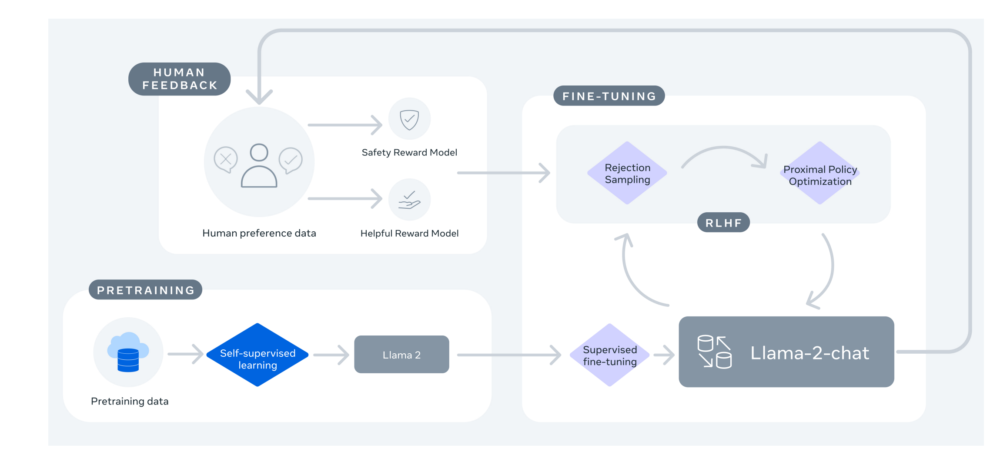

## 4.3 Llama-3系列

与Llama-2类似，Llama-3系列也有两个模型——预训练模型Llama-3和微调后的模型Llama-3-Instruct。

在预训练阶段，为了有效地利用预训练数据，Llama-3投入了大量精力来扩大预训练。具体而言，通过为下游基准测试制定一系列扩展法则（scaling laws），使得在训练之前就能预测出模型在关键任务上的性能，进而选择最佳的数据组合。

在这一过程中，Llama-3对扩展法则有了一些新的观察。例如，根据DeepMind 团队提出的Chinchilla [11]扩展法则，8B模型的最优训练数据量约为200B token，但实验发现，即使训练了两个数量级的数据后，模型性能仍在继续提高。在多达15T token上进行训练后，8B和70B参数的模型都继续以对数线性的方式提升性能。

为了训练最大的Llama-3模型，Meta结合了三种并行策略：数据并行、模型并行和流水并行。当同时在16K GPU上进行训练时，最高效的策略实现了每个GPU超过400 TFLOPS的计算利用率。最后，模型在两个定制的24K GPU集群上进行了训练。

为了最大限度地延长GPU的正常运行时间，Meta开发了一个先进的新训练堆栈，可以自动检测、处理和维护错误。另外还大大提高了硬件可靠性和无声数据损坏的检测机制，并开发了新的可扩展存储系统，减少了检查点和回滚的开销。这些改进使总的有效训练时间超过95%。综合起来，这些改进使Llama-3的训练效率比Llama-2提高了约三倍。

在微调阶段，Meta对模型的微调方法进行了重大创新，结合了有监督微调（Supervised Fine-Tuning, SFT）、拒绝采样、近似策略优化（Proximal Policy Optimization, PPO）和直接策略优化（Direct Policy Optimization, DPO）。这种综合方法优化了模型在执行复杂的推理和编码任务时的表现。特别是通过偏好排序的训练，Llama-3在处理复杂的逻辑推理问题时能更准确地选择最合适的答案，这对于提高AI在实际应用中的可用性和可靠性至关重要。

# 5. 效果对比
本节将对比不同版本在众多基准测试中的效果差异。

## 5.1 Llama-2 vs Llama-1

Meta官方数据显示，Llama-2在众多基准测试中都优于Llama-1和其他开源语言模型。

## 5.2 Llama-3 vs Llama-2

Meta官方数据显示，在各自参数规模上，Llama-3 8B和70B版本都取得了不错的成绩。8B模型在众多基准测试中均胜过Gemma 7B和Mistral 7B Instruct，而70B模型超越了闭源模型Claude 3 Sonnet，对比谷歌的Gemini Pro 1.5性能也是相当。
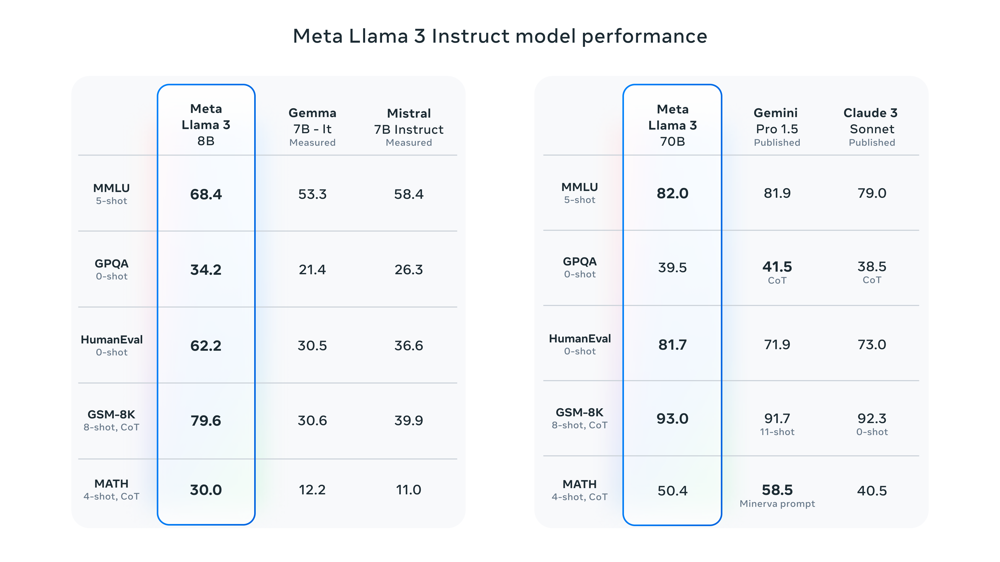

同时，在Llama-3的开发过程中，Meta还开发了一个包含1800个提示的高质量人类评估集。
评测结果显示，Llama 3不仅大幅超越Llama 2，也战胜了Claude 3 Sonnet、Mistral Medium和GPT-3.5这些知名模型。

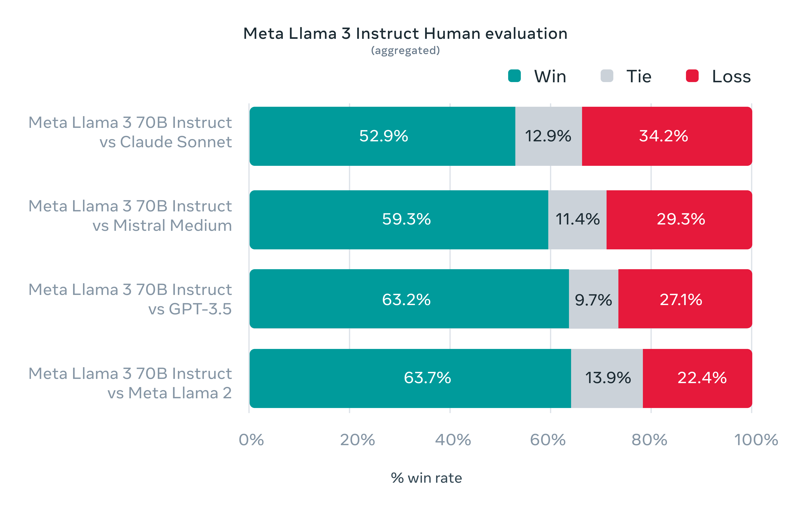

Llama-3之所以能够取得如此出色的成绩，离不开它预训练模型的优异性能。
在众多基准测试中，8B模型超越了Mistral 7B和Gemma 7B，70B模型则战胜了Gemini Pro 1.0和Mixtral 8x22B。

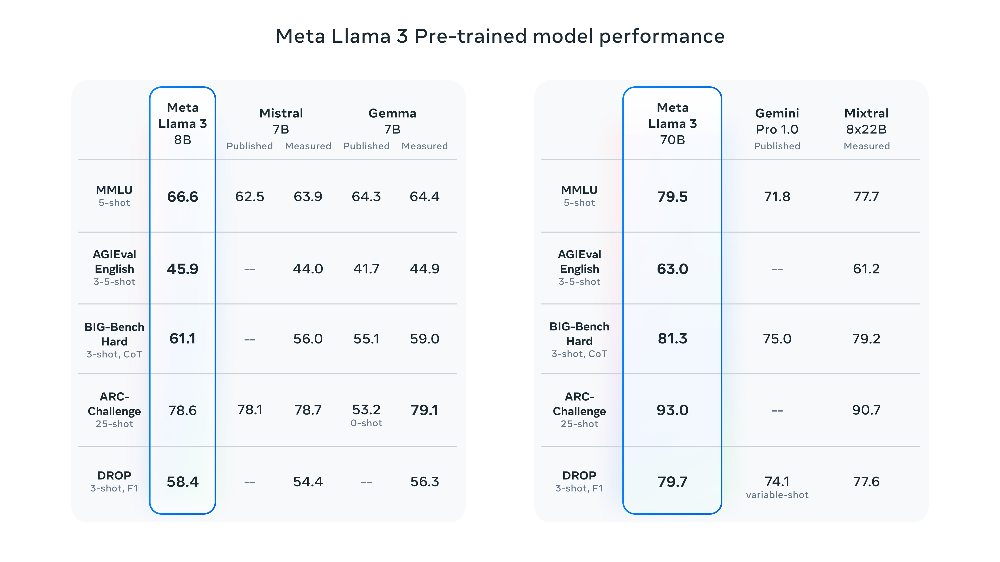

另外，Meta表示，最大的Llama-3仍在训练中，其参数超过400B，并在多项基准测试中取得了出色的成绩。
一旦完成训练，Meta将发表一篇详细的研究论文。

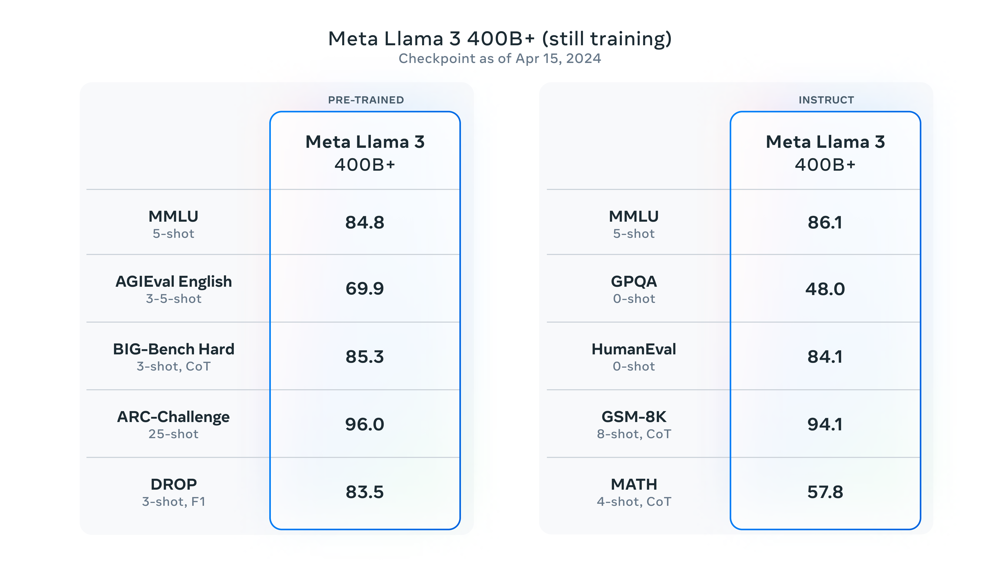

值得注意的是，根据英伟达科学家Jim Fan的整理，Llama3 400B基本逼近Claude-3-Opus和GPT-4-turbo，这将意味着开源社区即将迎来GPT-4级大模型。

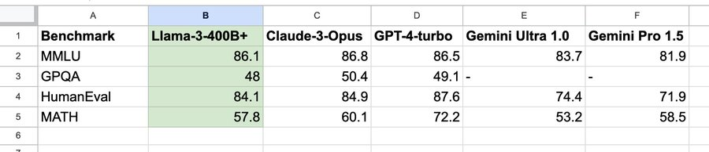

# 6. 社区影响
本节将简要介绍Llama模型对开源社区的影响。

## 6.1 开放源代码模型的力量

自Meta发布Llama模型以来，它对全球AI社区产生了深远的影响。作为一个开源的大语言模型（LLM），Llama不仅提供了一个强大的技术基础，还推动了全球范围内对AI技术的广泛采用和创新。

Llama模型的开源策略被视为LLM时代的“安卓”，这意味着它提供了一个模块化和可自定义的平台，使研究人员和开发者能够根据自己的需要调整和优化模型。这种开放性极大地降低了进入门槛，使得从小型创业公司到大型企业都能够利用这一技术。四月十九日的Llama 3的发布，一日的下载量已经突破了1.14k，两个8B的模型位列trending第一。

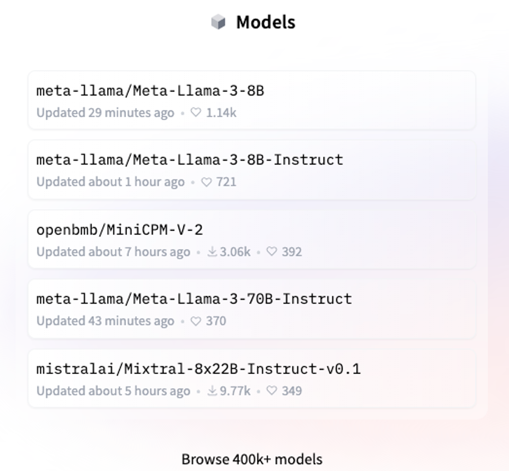

## 6.2 对全球AI研发的影响

在OpenAI转向更封闭的商业模式后，Llama的发布为全球进行AI项目研发的团队和个人提供了一种可靠的选择。这种开源模型确保了用户不必完全依赖单一的商业API，从而增加了企业的运营安全感和自由度，尤其是在数据安全和成本控制方面。

## 6.3 技术进步和社区创新

技术上，Llama模型已经展示了与GPT相媲美的性能，这证明了开源社区在推动前沿技术方面的能力。此外，社区通过对模型的不断优化和调整，在不同的垂直领域中开发出适用的解决方案，类似于Stable Diffusion和Midjourney等社区驱动的大模型。

##6.4 生态系统和多样性

Llama的应用已经扩展到多种平台和设备，包括移动和边缘设备。这种多样化的应用不仅推动了技术的普及，也加速了新应用的创新。例如，云平台如AWS和Google Cloud的积极参与，证明了Llama模型的广泛适用性和强大功能。

## 6.5 Llama社区的未来展望

随着Llama模型的持续发展和优化，Meta强调了对多模态AI、安全性和责任以及社区支持的持续关注。这些方向不仅符合当前AI发展的趋势，也为Llama社区的未来提供了明确的路线图。

# 7. 总结

总之，Llama模型的发布不仅证明了开源模型在全球AI领域的重要性，也为AI的未来发展方向提供了新的视角和动力。通过持续的技术进步和社区驱动的创新，Llama有望继续推动全球AI技术的广泛应用和发展。

参考文献
[1] Touvron H, Lavril T, Izacard G, et al. Llama: Open and efficient foundation language models[J]. arXiv preprint arXiv:2302.13971, 2023.

[2] Touvron H, Martin L, Stone K, et al. Llama 2: Open foundation and fine-tuned chat models[J]. arXiv preprint arXiv:2307.09288, 2023.

[3] Vaswani A, Shazeer N, Parmar N, et al. Attention is all you need[J]. Advances in neural information processing systems, 2017, 30.

[4] Devlin J, Chang M W, Lee K, et al. Bert: Pre-training of deep bidirectional transformers for language understanding[J]. arXiv preprint arXiv:1810.04805, 2018.

[5] Radford A, Narasimhan K, Salimans T, et al. Improving language understanding by generative pre-training[J]. 2018.

[6] Zhang B, Sennrich R. Root mean square layer normalization[J]. Advances in Neural Information Processing Systems, 2019, 32.

[7] Shazeer N. Glu variants improve transformer[J]. arXiv preprint arXiv:2002.05202, 2020.

[8] Su J, Ahmed M, Lu Y, et al. Roformer: Enhanced transformer with rotary position embedding[J]. Neurocomputing, 2024, 568: 127063.

[9] Ainslie J, Lee-Thorp J, de Jong M, et al. Gqa: Training generalized multi-query transformer models from multi-head checkpoints[J]. arXiv preprint arXiv:2305.13245, 2023.

[10] Sennrich R, Haddow B, Birch A. Neural machine translation of rare words with subword units[J]. arXiv preprint arXiv:1508.07909, 2015.

[11] Hoffmann J, Borgeaud S, Mensch A, et al. Training compute-optimal large language models[J]. arXiv preprint arXiv:2203.15556, 2022.

[12] https://github.com/facebookresearch/xformers
